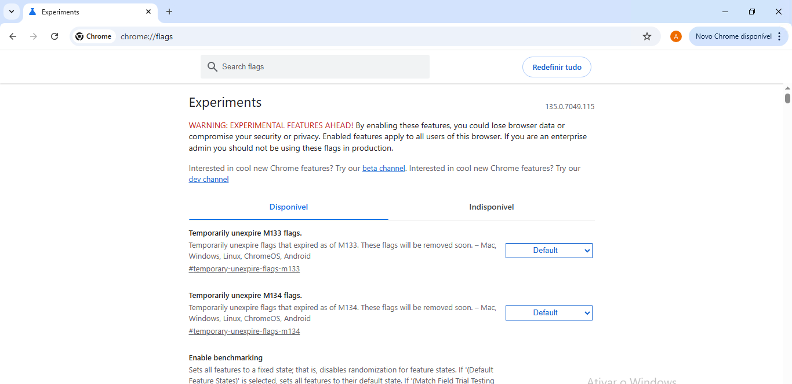
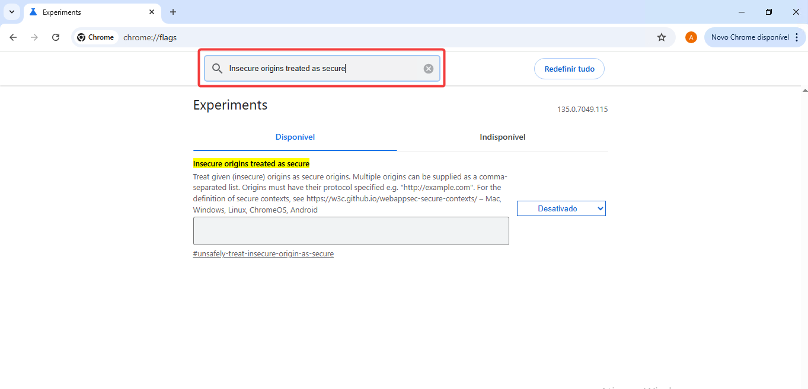
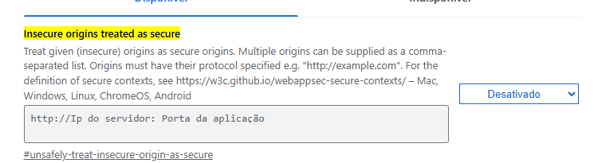
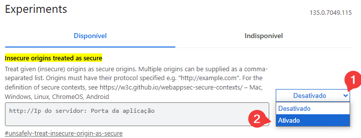

# 🛠 Habilitar Câmera (Chrome Flags)

> Versão 1.0 | Atualizado em: 12/05/2025

---

## 📌 1. Chrome Flags

Para habilitar a webcam em um ambiente sem domínio, é necessário ativar uma flag no Chrome. Para isso, acesse o navegador e digite na barra de endereços:
`chrome://flags/`

Na barra de pesquisa, digite:
`Insecure origins treated as secure`

No campo de entrada de texto, insira a URL:
`http://Ip do servidor: Porta da aplicação`;
onde IP do servidor é o endereço da máquina e Porta da aplicação é onde o software está sendo executado.
Exemplo:
`http://127.0.0.1:4000`

No campo Select, que por padrão está como "Desativado", clique e selecione a opção "Ativado". Após isso, reinicie o navegador.

---
