# Manual de Instalação do Ponto de Controle com Integração GATEC

> Versão 1.0 | Atualizado em: 23/04/2025

---

## 📌 Sumário

- [Termos de Uso](#tdu)
- [Introdução](#int)

- [1. Arquivos Necessários](#cap1)
- [2. Instalação](#cap2)
- [3. Instalação MySQL](#cap3)
- [4. Criação do banco de dados do Ponto de Controle](#cap4)
- [5. Instalação do GATEC](#cap5)
- [6. Instalação do Ponto de Controle](#cap6)
- [7. Integração do Ponto de Controle com o GATEC](#cap7)
- [8. Instalação e Configuração do IntegradorGATEC](#cap8)

---

## ⚖️ Termos de Uso

Este manual, ou qualquer parte dele, **não pode** ser reproduzido, copiado, modificado ou distribuído sem autorização prévia e expressa da **Saturno Smart**. A Saturno Smart reserva‑se o direito de revisar e aprimorar seus produtos sempre que considerar necessário. Esta publicação reflete o estado do produto na **data de sua emissão** e pode não corresponder a futuras versões ou atualizações.

---

## 🧾 Introdução

Este documento tem como finalidade instruir e guiar o operador na instalação adequada do software Ponto de Controle, assim como a integração com o software GATEC.

---

## 📁 1. Arquivos Necessários

Todos os arquivos necessarios para a instalação do Ponto de Controle com integração com o GATEC se encontram na pasta dispbonibilizada pela equipe da Saturno Smart.

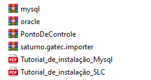

---

## ⚙️ 2. Instalação

O primeiro passo para instalar o Ponto de Controle é criar a pasta "SMART" no caminho "C:\" ou "D:\".

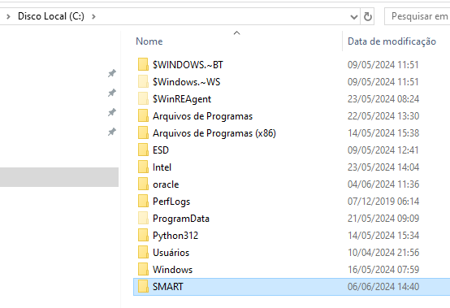

Dentro da pasta "SMART" copie os arquivos disponibilizados pela equipe da Saturno Smart e descompacte-os.

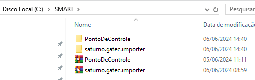

---

## 🐬 3. Instalação MySQL

Utilizar o arquivo “mysql” fornecido na pasta de instalação e seguir as instruções do “Tutorial_de_instalação_Mysql.pdf”, disponível na pasta de instalação.

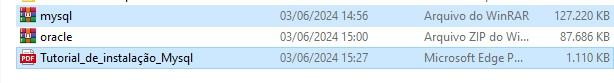

---

## 🗄️ 4. Criação do banco de dados do Ponto de Controle

Após instalação do Mysql, abrir o arquivo pc_v3_template.sql (disponível na pasta “PontoDeControle”) com o bloco de notas.
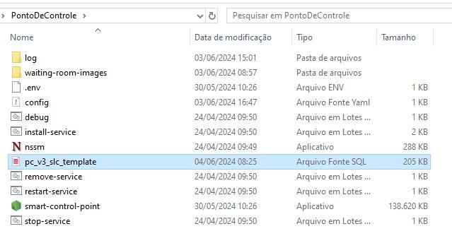

Copie todo o conteudo do arquivo
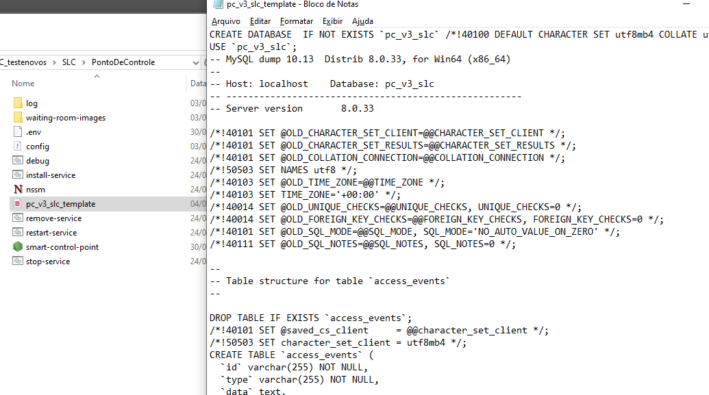

Abra o Workbench e crie uma "query" com o conteudo copiado.
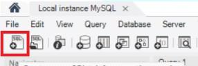

Após criar a query, execute-a clicando no ícone de raio no canto superior esquerdo.
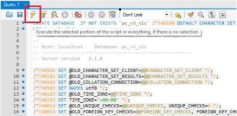

**OBS: Este script cria o banco de dados do ponto de controle com as rotas e pontos de controle padrão da unidade SLC. Dentro deste banco criamos duas operações e itens básicos para que a equipe de serviços possa executar os testes de validação.**

---

## 🏗️ 5 Criando banco "gatec_smart"

Crie o banco de dados "gatec_smart" para que o time do GATEC execute o script deles. Para isso:

- Abra o Workbench e crie um schema clicando com o botão direito no lado esquerdo da tela.
- Clique em "Create Schema"
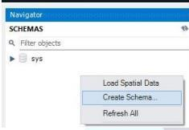
- Insira o nome "gatec_smart"

- Clique em "Apply" no canto inferior direito

- Clique em "Apply"  novamente
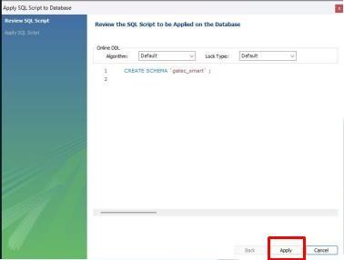
- Clique em "Finish"
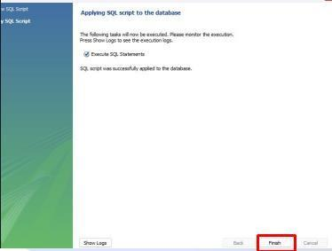

---

## 🦾 6. Instalação do Oracle

Descompacte o arquivo "oracle.rar" que se encontra disponivel na pasta de instalação clicando com o botão direito no arquivo e selecione a opção "Extrair aqui".
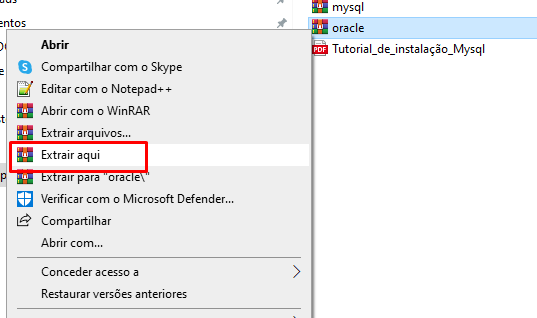

Após isso, copie a pasta descompactada e cole no diretório C:\
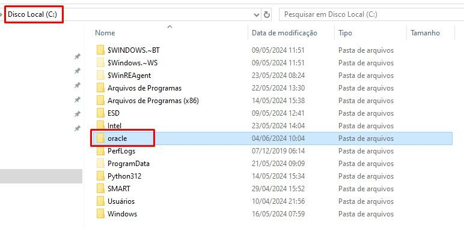

Abra o arquivo “config” que está dentro da pasta “saturno.gatec.importer” que foi
descompactada no item 2.1, com o bloco de notas
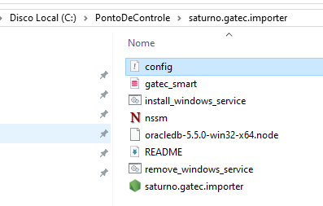

Verifique se o caminho onde você colocou a pasta Oracle no item 5.1 está correto
no “config”. asdvkçJABSo
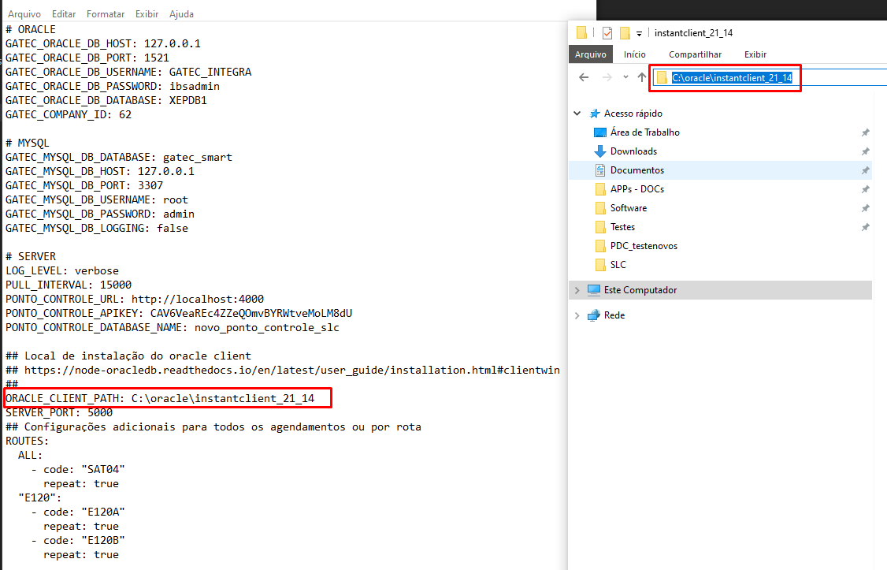

---

## 🧩 7. Instalação do Ponto de Controle

Abra a pasta do software Ponto de Controle criado no C:\ e inicialize o aplicativo
clicando no arquivo “smart-control-point.exe”
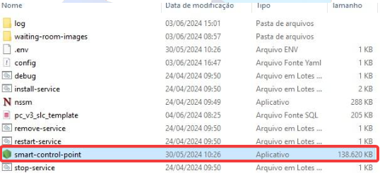

O software Ponto de controle vai estar disponível no endereço: **<http://127.0.0.1:4000>**.
Para ingresso do sistema utilize:

- Usuário: master
- Senha: ibsadmin
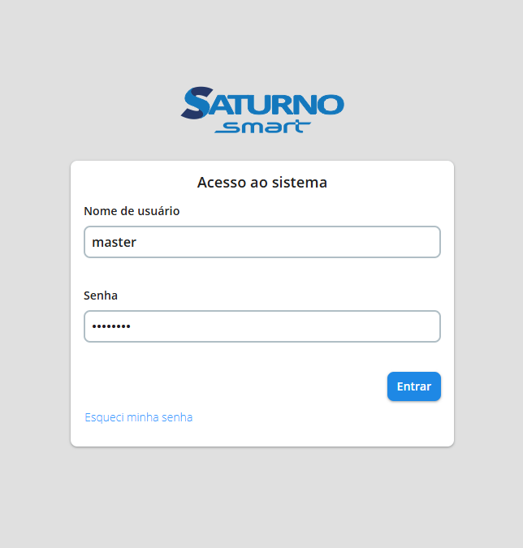

Crie uma chave API para ser usada na integração com o GATEC. Para isso acesso o menu "Administração" e clique em "Chaves de API" e em seguida clique em novo.
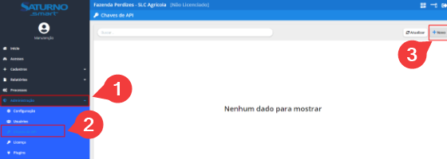

Criar API conforme modelo da imagem abaixo
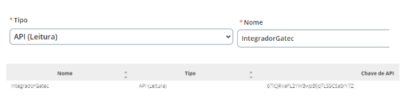

---

## 🔗 8. Instalação e Configuração do IntegradorGATEC

Essa aplicação é responsável por buscar os acessos no Gatec e criar no ponto de controle, ele também é responsável por salvar as informações de pesagem na tabela “gatec_smart”.

Abra o arquivo "config.yaml" do integrador GATEC com o bloco de notas
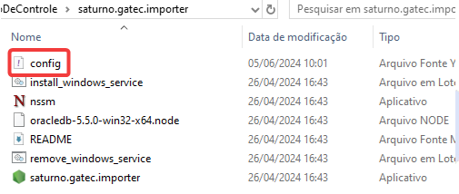

Após abrir o arquivo, edique o campo "GATEC_COMPANY_ID" com o número da fazenda.
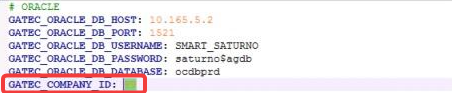

Após isso, edite o campo "GATEC_API_KEY" e insira a chave API criada no item 7.
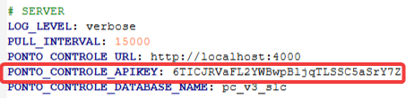

Depois disso, de permissão completa ao usuário "IntegradorGatec" no Ponto de Controle

Clique duas vezes no ícone marcado na imagem
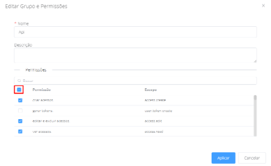

Aplique as configurações clicando em "Aplicar".
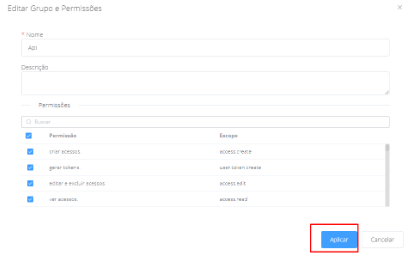

Inicie o integrador GATEC clicando duas vezes no arquivo "saturno.gatec.importer.exe"
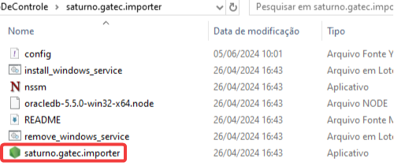
**O integrador funcionará corretamente somente depois que a equipe Gatec copular o
banco “gatec_smart” com seu script.**

As APIs do GATEC e do Ponto de Controle estarão disponíveis no endereço: **<http://127.0.0.1:5000>**
