# 🛠 Manual de Instalação SLC

> Versão 2.0 | Atualizado em: 13/05/2025

---

## 📑 Sumário

- [Termos de Uso](#tdu)
- [Introdução](#int)

### ⚙️ [CAPÍTULO 1: DESCRIÇÃO TÉCNICA](#cap1)

- [1.2 Arquivos Necessários](#11-an)

### ⚙️ [CAPÍTULO 2: INSTALAÇÃO](#cap2)

- [2.1 Instalação MySql](#21-im)
- [2.2 Instalação Oracle](#22-io)
- [2.3 Instalação Ponto de Controle](#23-ipdc)
- [2.4 Instalação Integrador Gatec](#24-iig)
- [2.5 Instalação Loge](#25-il)

### ⚙️ [CAPÍTULO 3: CONFIGURAÇÕES EXTRAS](#cap3)

- [3.1 Configuração Banco "gatec_smart"](#31-cbgs)
- [3.2 Configuração chave API](#32-cca)
- [3.3 Configuração de Serviços do Windows](#33-csw)

---

## ⚖️ Termos de Uso {#tdu}

Este manual, ou qualquer parte dele, **não pode** ser reproduzido, copiado, modificado ou distribuído sem autorização prévia e expressa da **Saturno Smart**. A Saturno Smart reserva‑se o direito de revisar e aprimorar seus produtos sempre que considerar necessário. Esta publicação reflete o estado do produto na **data de sua emissão** e pode não corresponder a futuras versões ou atualizações.

---

## 🧾 Introdução {#int}

Este documento tem como finalidade instruir e guiar o operador na instalação adequada do software Ponto de Controle, assim como a integração com o software GATEC.

---

# ⚙️ CAPÍTULO 1: DESCRIÇÃO TÉCNICA {#cap1}

## 📌 1.1 Arquivos Necessários {#11-an}

Os arquivos necessários para a instalação do software estão disponíveis no seguinte caminho:

- **SharePoint:** `https://ibstecn.sharepoint.com/sites/software/Downloads/Forms/AllItems.aspx`

    - **Ponto de Controle:** `Downloads/01. Saturno Smart V5 [Ponto de Controle]`
    - **Integrado GATEC:** `Downloads/04. Integrações/Gatec`
    - **Saturno Loge:** `Downloads/03. Loge Dashboard`
    - **OCR:** `Downloads/09. Smart OCR API [Jidosha]`
    - **MySql:** `Ferramentas/mysql-installer-community-8.0.40.0.msi`
    - **Oracle:** `Ferramentas/oracle.rar`

---

# ⚙️ CAPÍTULO 2: INSTALAÇÃO {#cap2}

## 📌 2.1 Instalação MySql {#21-im}

Faça o download do arquivo `mysql-installer-community-8.0.40.0.msi`, mencionado no [tópicpo 1.1](#11-an). Execute o arquivo `.msi`.

No menu "Choosing a Setup Type", selecione a opção "Custom" e clique em "Next".
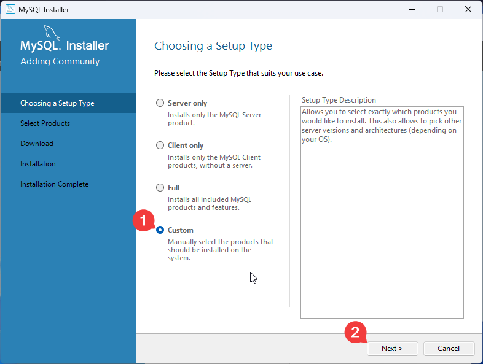

No menu "Select Products", expanda as opções de "MySQL Server" e "Applications", transfira os pacotes MySQL Server 8.0.42 e MySQL Workbench 8.0.42, e clique em "Next".
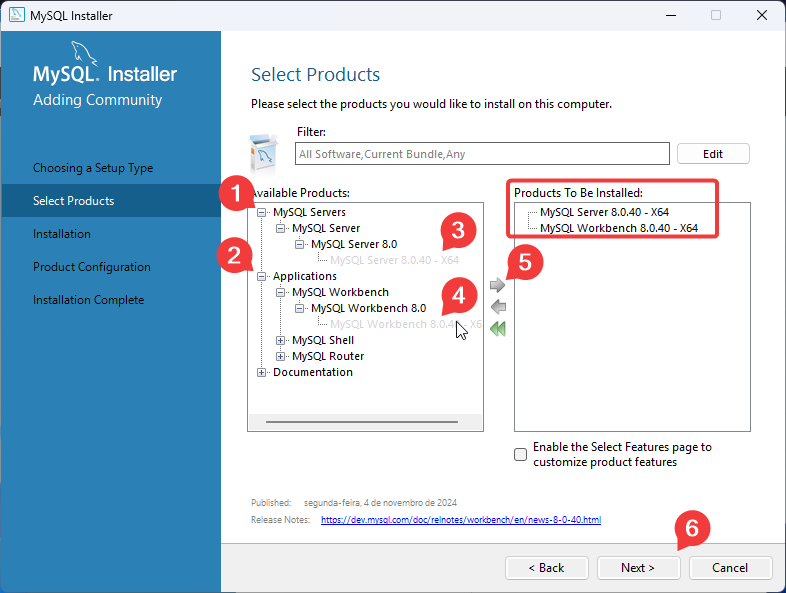

No menu "Check Requirements", clique em "Execute", instale todos os pacotes do Visual C++ exigidos e, ao final, clique em "Next".
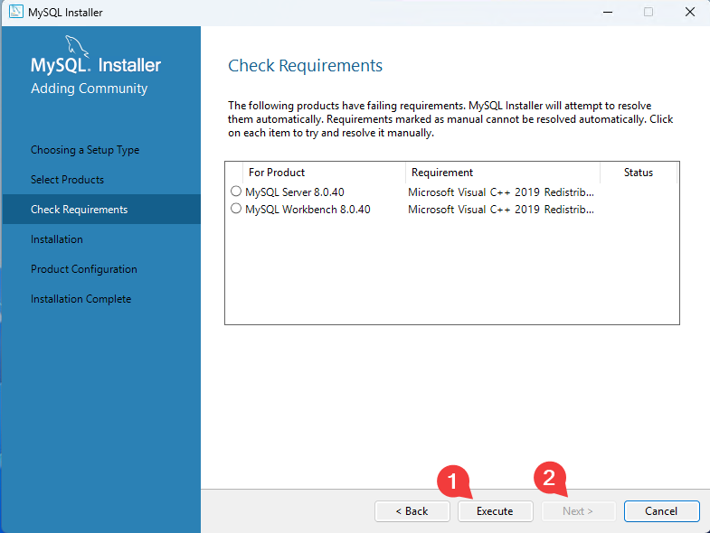

No menu "Installation", clique em "Execute" e, após a finalização, clique em "Next".
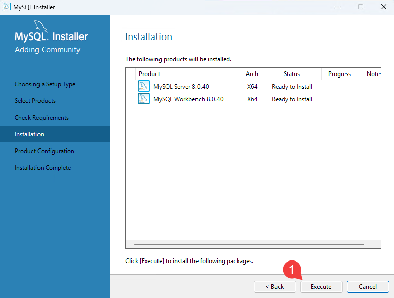

No menu "Product Configuration", clique em "Next".
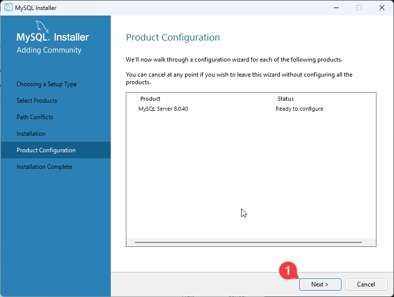

No menu "Type and Networking", altere o campo "Config Type" para "Server Computer" e clique em "Next".
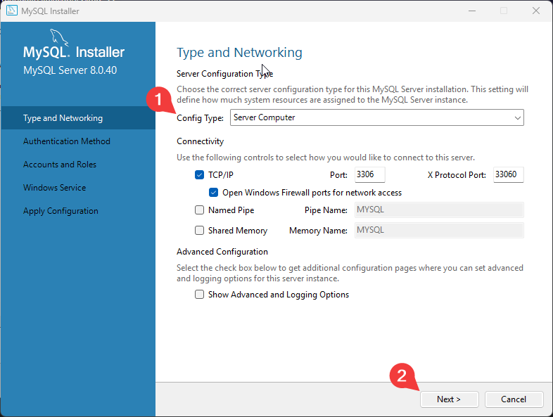

No menu "Authentication Method", defina o método de autenticação que será utilizado:

| Método de Autenticação | Nome Técnico | Segurança | Compatibilidade | Observações |
|------------------------|------------------------|------------------|---------------------------|------------------------------------------------------------------------------|
| Legacy Authentication Method | `mysql_native_password`| Baixa a moderada | SSV4 (clientes antigos)   | Compatível com clientes mais antigos (MySQL < 8.0). O Ponto de Controle também aceita esse método. |
| Strong Password Encryption for Authentication | `caching_sha2_password`| Alta | Ponto de Controle | Padrão a partir do MySQL 8.0. Mais seguro, evita tráfego de senha em texto claro. |

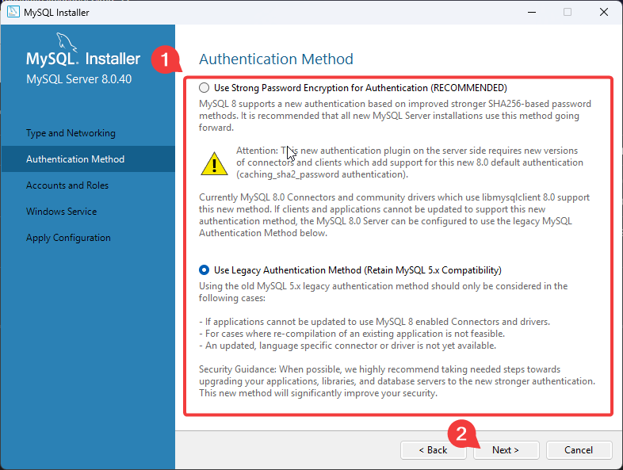

No menu "Accounts and Roles", defina a senha do usuário root. Por padrão, a Saturno utiliza a senha `Baloo001`.
Adicione dois usuários chamados **smart** — um com escopo **global** e outro com escopo **local**. Para isso, clique em "Add User"..
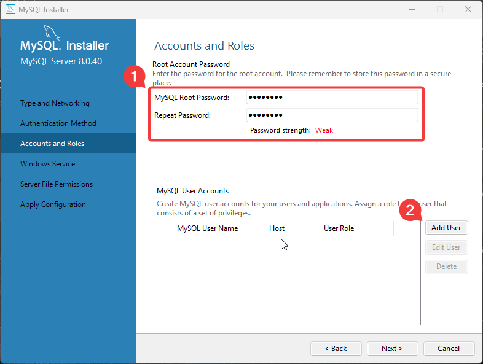

Após clicar em "Add User", será exibido um formulário. Preencha da seguinte forma:

- User Name: `smart`
- Host: `%` (para usuário global) ou `localhost` (para usuário local)
- Password: utilize a mesma senha do root (`Baloo001`)
Clique em "OK".
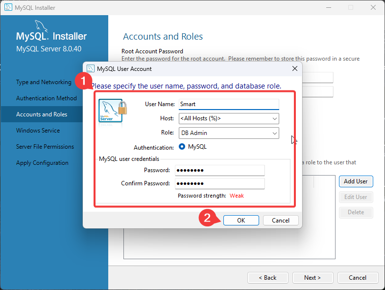

Após adicionar os dois usuários extras, clique em "Next".
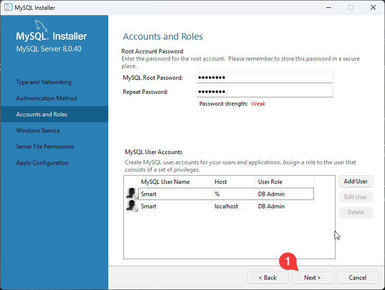

No menu "Windows Service", clique em "Next".
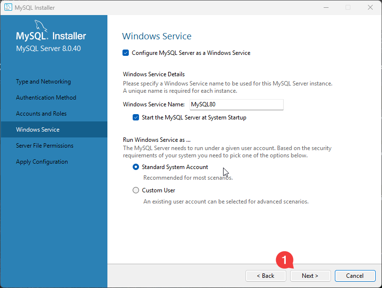

No menu "Server File Permissions", clique em "Next".
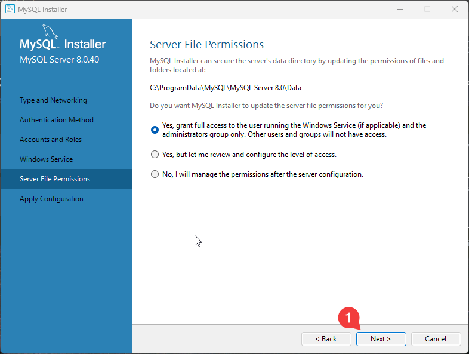

No menu "Apply Configuration", clique em "Execute" e, ao concluir, clique em "Finish".
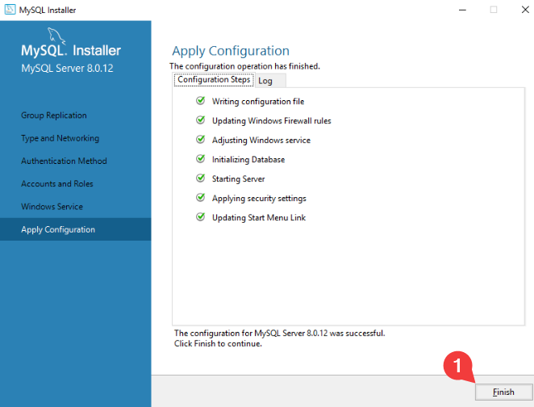

## 📌 2.2 Instalação Oracle {#22-io}

Faça o download do arquivo `oracle.rar`, mencionado no [tópicpo 1.1](#11-an). Em seguida, descompacte o arquivo e mova o conteúdo para o diretório `C:\`.
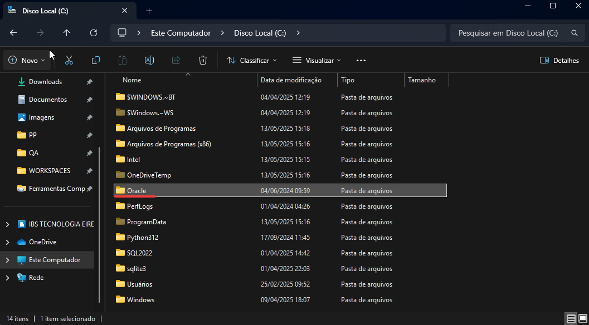

## 📌 2.3 Instalação Ponto de Controle {#23-ipdc}

Faça o download do arquivo `.zip` que estiver dentro da pasta mencionada no [tópico 1.1](#11-an). Em seguida, descompacte o arquivo, crie uma pasta no diretório `C:\` com o nome **"SMART"** e mova o conteúdo para essa pasta.
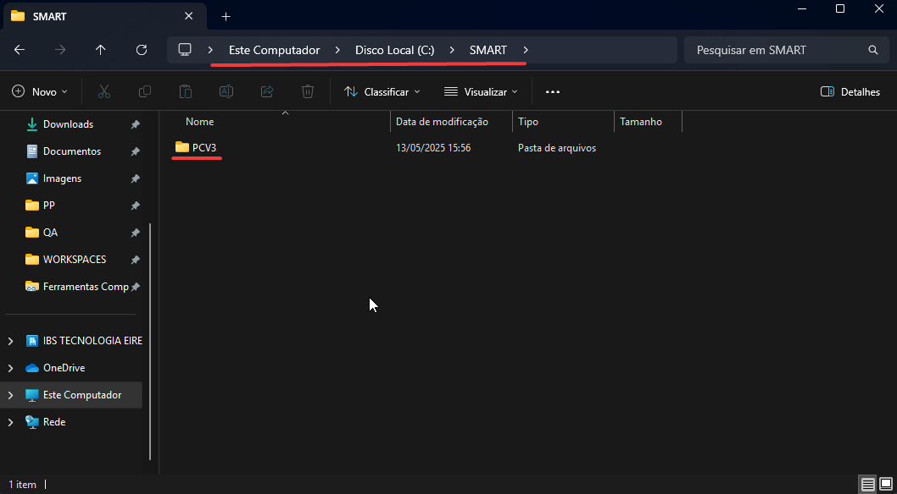

Dentro da pasta "PCV3", execute o arquivo `smart-control-point`.
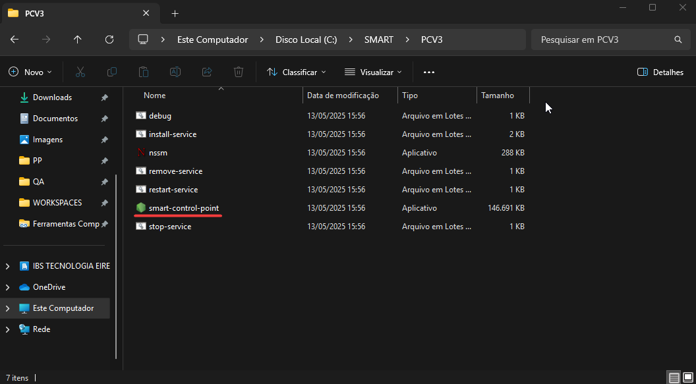

O servidor será iniciado. Em seguida, abra uma página no navegador e acesse o endereço `127.0.0.1:4000`.
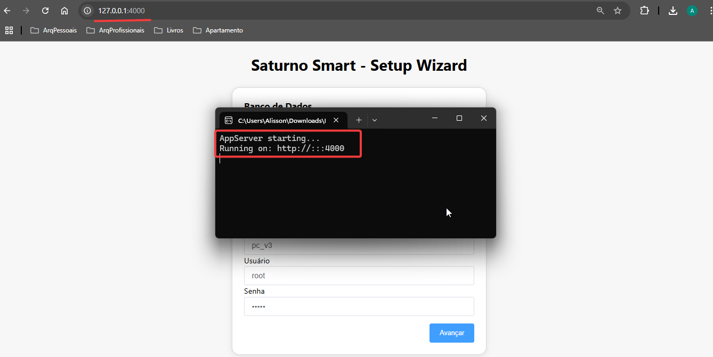

Ao acessar o endereço informado acima, será exibido o Setup Wizard. Preencha os campos da primeira seção da seguinte forma:

- Em "Tipo do Banco", mantenha selecionado MySQL;
- Informe o IP e a Porta do banco (devem ser os mesmos utilizados durante a instalação do banco);
- Em "Banco de Dados", defina o nome do banco — por padrão, o sistema sugere "pc_v3";
- Em "Usuário" e "Senha", utilize as credenciais do usuário **Smart**, criado no [tópico 2.1](#21-im)
Clique em "Avançar".
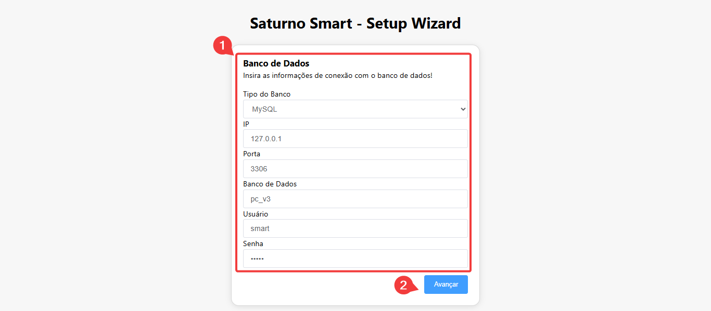

Após a inicialização do banco, você poderá definir um usuário administrador preenchendo os campos com usuário e senha, ou optar por pular essa etapa e criar o usuário posteriormente.
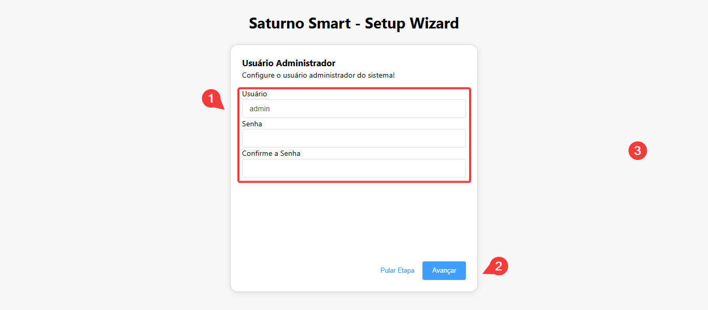

Na etapa do "Modelo Inicial", selecione a opção "Importar do Arquivo" e utilize o template disponibilizado pela equipe de projetos. Esse arquivo deve estar localizado dentro da pasta do projeto.
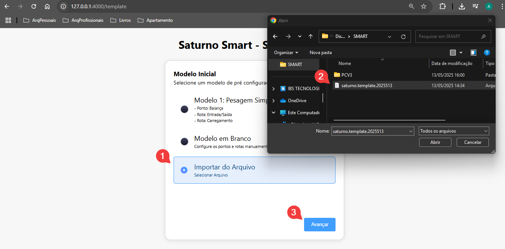

## 📌 2.4 Instalação Integrador Gatec {#24-iig}

Faça o download do arquivo `.zip` que estiver dentro da pasta mencionada no [tópico 1.1](#11-an). Em seguida, descompacte o arquivo e mova o conteúdo para a pasta **"SMART"**, criada no [tópico 2.3](#23-ipdc).
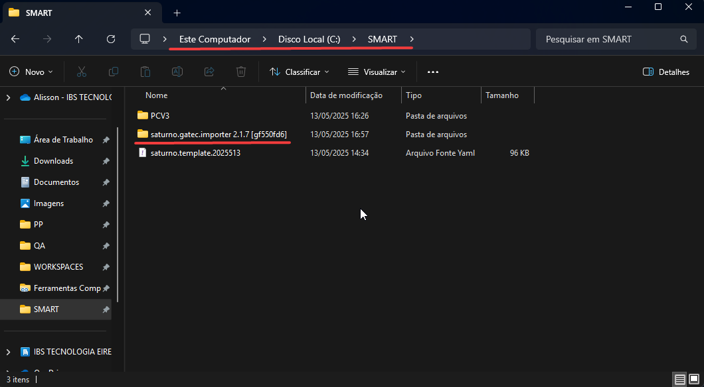

Dentro da pasta "saturno.gatec.importer 2.1.7 [gf550fd6]", edite o arquivo `config.json` conforme as instruções abaixo:
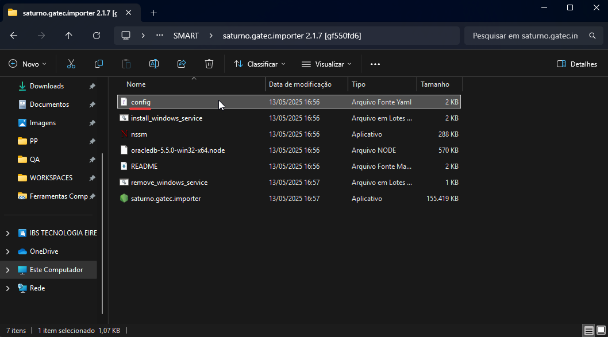

Configurações do Arquivo `config.json`

🔶 Oracle

- GATEC_ORACLE_DB_HOST: 10.165.5.2
- GATEC_ORACLE_DB_PORT: 1521
- GATEC_ORACLE_DB_USERNAME: SMART_SATURNO
- GATEC_ORACLE_DB_PASSWORD: saturno$agdb
- GATEC_ORACLE_DB_DATABASE: ocdbprd
- GATEC_COMPANY_ID: 62 **→ Alterar para o ID da unidade onde o sistema está sendo instalado.**

🔶 MySql

- GATEC_MYSQL_DB_DATABASE: gatec_smart **→ Criado no [tópico 3.1](#31-cbgs)**
- GATEC_MYSQL_DB_HOST: 127.0.0.1
- GATEC_MYSQL_DB_PORT: 3306
- GATEC_MYSQL_DB_USERNAME: root **→ Manter como "root", mesmo que outro usuário tenha sido criado no [tópico 2.1](#21-im)**
- GATEC_MYSQL_DB_PASSWORD: Baloo001 **→ Utilizar a senha configurada no [tópico 2.1](#21-im)**
- GATEC_MYSQL_DB_LOGGING: false

🔶 Server

- LOG_LEVEL: verbose →Define o nível de detalhamento dos logs (`verbose:` mais detalhes e `slient:` não gera logs)
- PULL_INTERVAL: 15000
- PONTO_CONTROLE_URL: <http://localhost:4000>
- PONTO_CONTROLE_APIKEY: 5nPeZf2EXmeRLh6mpVBbbhHOfQvCf0Wi **→ Usar a chave de API criada no [tópico 3.2](#32-cca)**
- PONTO_CONTROLE_DATABASE_NAME: pc_v3 **→ Nome do banco de dados criado no [tópico 2.3](#23-ipdc)**

🔶 Oracle_Client_Path

- Descomente a linha onde se encontra o caminho do Oracle Client, removendo o `#` do início da linha.
- Certifique-se de que o caminho está correto, apontando para onde o Oracle Client foi descompactado no [tópico 2.2](#22-io).

🔶 Server Port

- Define a porta em que o integrador será executado.
- Por padrão, utilizamos a porta `5000`, mas verifique se ela corresponde à porta configurada nos webhooks do Ponto de Controle.

🔶 Routes

- Essa seção é utilizada para configurar rotas com repetição automática ou criação de rotas adicionais a partir de rotas integradas via GATEC.
Exemplo:
A rota `E120`, criada no GATEC, também cria automaticamente a rota `SAT12`, ambas com o campo repeat = true, ou seja, com repetição automática ativada.

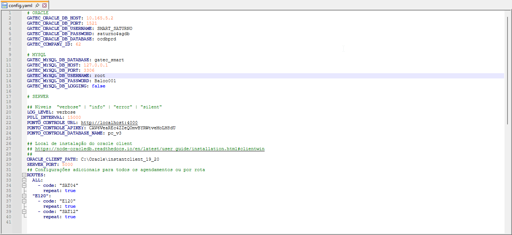

## 📌 2.5 Instalação Loge {#25-il}

Faça o download do arquivo `saturno-loge-2.0.5-setup.exe`, mencionado no [tópicpo 1.1](#11-an), e execute o arquivo `.exe`.

Clique em "Próximo".
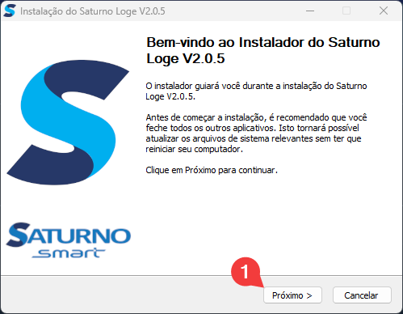

Clique em "Eu Concordo" para aceitar os termos de licença.
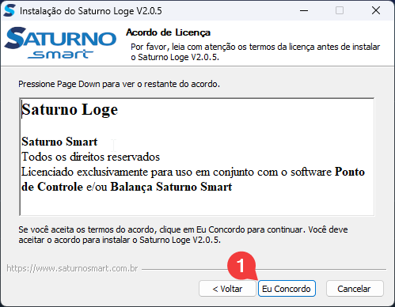

Na etapa de escolha do diretório de instalação, selecione a pasta **SMART**, criada no [tópico 2.3](#23-ipdc). Para isso, clique em **"Procurar..."**, navegue até a pasta desejada e, em seguida, clique em "Próximo".
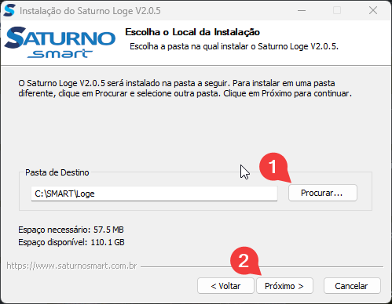

No menu de configurações de conexão, preencha os campos da seguinte forma:

- **Empresa:** mantenha "Saturno Smart" (valor padrão), ou altere conforme necessidade da SLC.
- **URL DB Ponto de Controle:**

    Altere os parâmetros da URL conforme abaixo:

    - `username`: `smart`
    - `password`: `Baloo001`
    - `db_name`: `pc_v3`
    (Caso tenha utilizado credenciais ou nome de banco diferentes, substitua pelos corretos.)
- **URL Ponto de Controle:** `http://localhost:4000`
- **Porta:** Por padrão, a porta é 5000. No entanto, para evitar conflito com o integrador GATEC:
    - Se o integrador estiver utilizando a porta 5000, defina 5001 aqui.
    - Se o integrador estiver em 5001, mantenha 5000 para o Loge. 
Clique em "Instalar" para prosseguir.

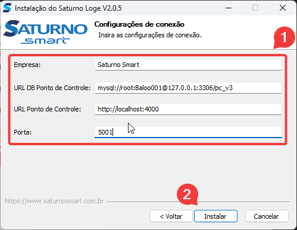

Ao final da instalação, mantenha o checkbox selecionado para que o Loge seja instalado como **serviço do Windows** e clique em "Concluir".
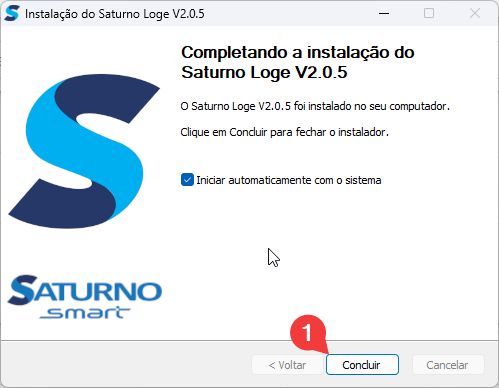

---

# ⚙️ CAPÍTULO 3: CONFIGURAÇÕES EXTRAS {#cap3}

## 📌 3.1 Configuração Banco "gatec_smart" {#31-cbgs}

Este banco de dados é utilizado para a integração entre o sistema Ponto de Controle e o GATEC. As informações de pesagem e portaria serão armazenadas nele, enquanto os dados de produtos, operações e liberações serão buscados a partir dele.

Passo a passo para criação do banco:

Abra o Workbench instalado junto com o MySQL no [tópico 2.1](#21-im) e acesse o servidor da unidade.

No menu lateral esquerdo, clique com o botão direito do mouse e selecione a opção "Create Schema".

No campo "Name", insira o nome `gatec_smart` e clique em "Apply".
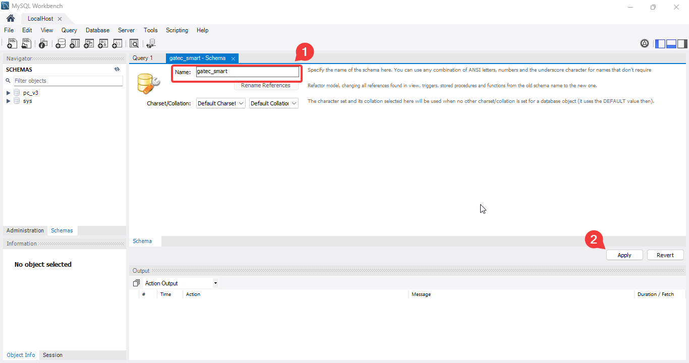

Clique novamente em "Apply" para confirmar a criação.
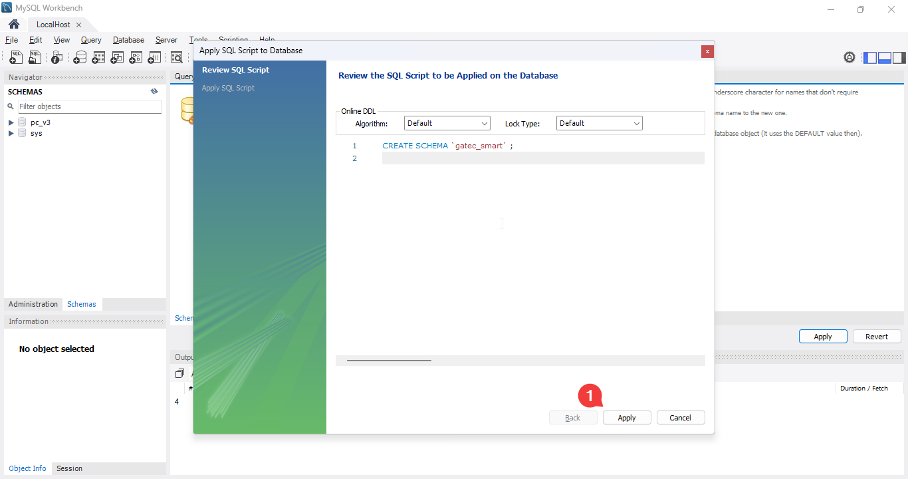

Por fim, clique em "Finish".
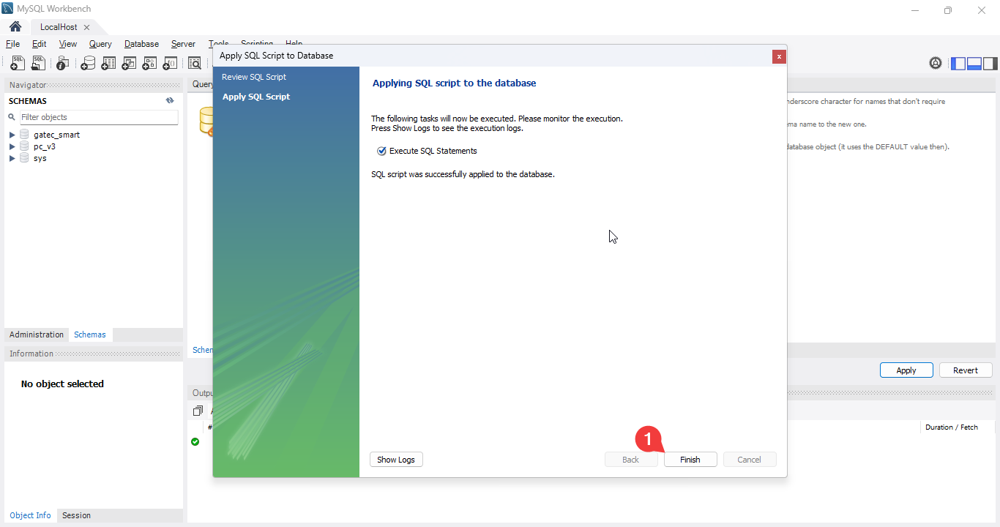

## 📌 3.2 Configuração chave API {#32-cca}

A chave API é utilizada para realizar a comunicação entre o software Ponto de Controle e o Integrador GATEC.

Acesse o Ponto de Controle e navegue até o menu: "Administração > Chave de API".
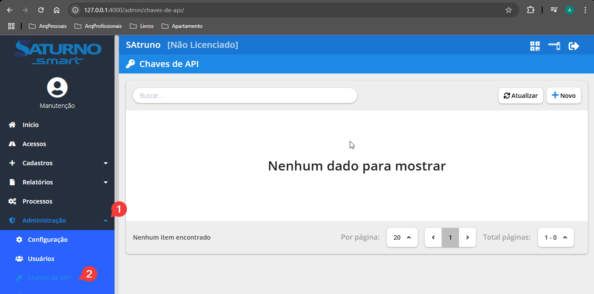

Clique em "+ Novo".
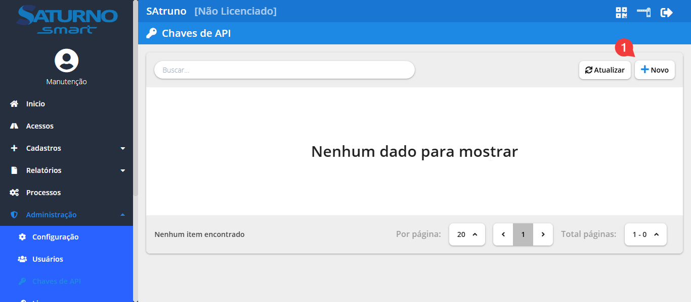

Na tela seguinte. Em "Tipo" mantenha a opção "API (Leitura)". Em "Nome", insira `Integrador GATEC` e clique em "Próximo".
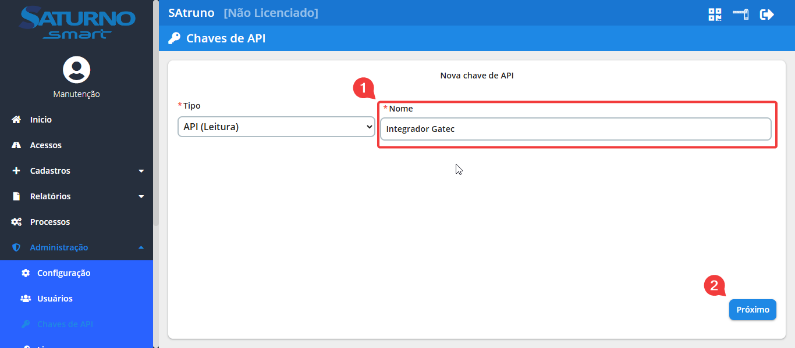

Clique em "Adicionar".
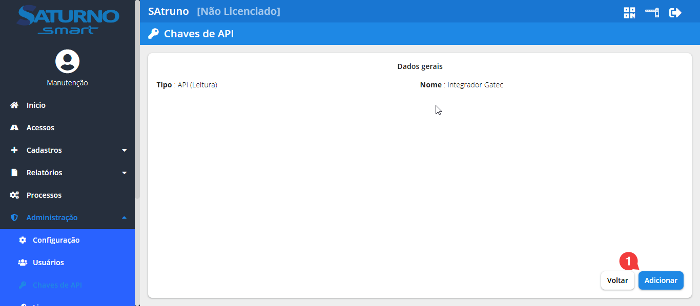

Em seguida, clique em "Concluído".
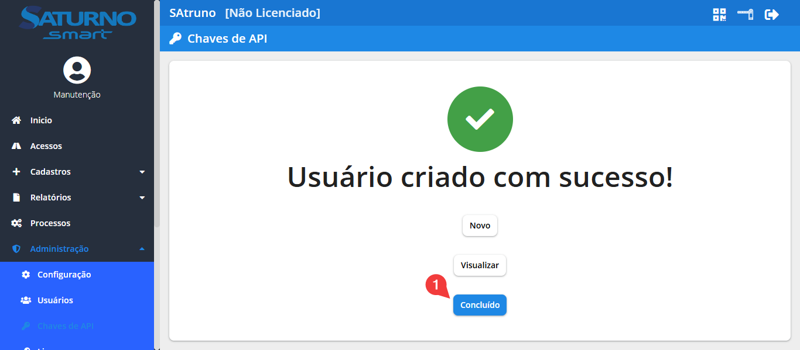

O valor da chave API será exibido na coluna "Chave de API".
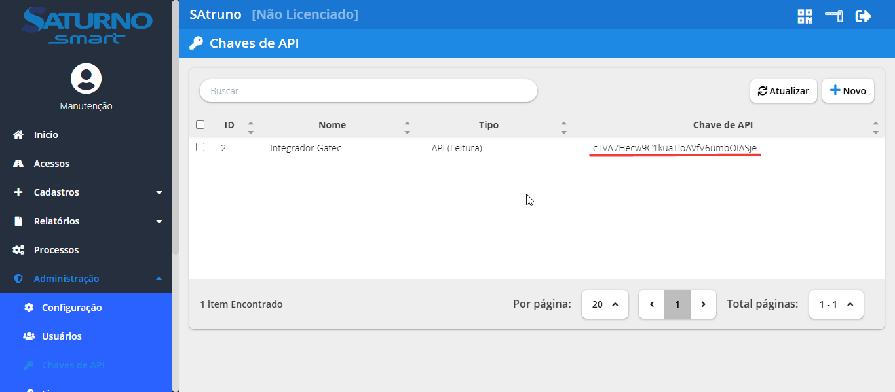

## 📌 3.3 Configuração de Serviços do Windows {#33-csw}

Inicialmente, tanto o Ponto de Controle quanto o Integrador GATEC são executados em modo terminal. No entanto, para que sejam executados automaticamente como serviços do Windows, é necessário realizar a instalação manual utilizando arquivos `.bat`.

Siga os passos abaixo:

- Acesse a pasta PCV3 e localize o arquivo install-service.bat.
- Clique com o botão direito sobre o arquivo e selecione "Executar como administrador".
- Em seguida, vá até a pasta saturno.gatec.importer 2.1.7 [gf550fd6].
- Localize o arquivo install_windows_service.bat.
- Novamente, clique com o botão direito e selecione "Executar como administrador".

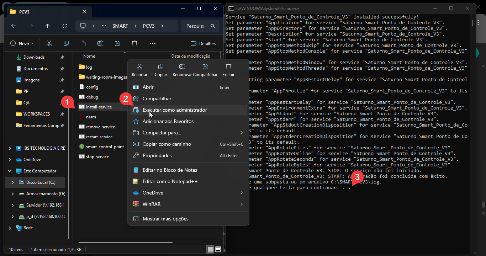

---
