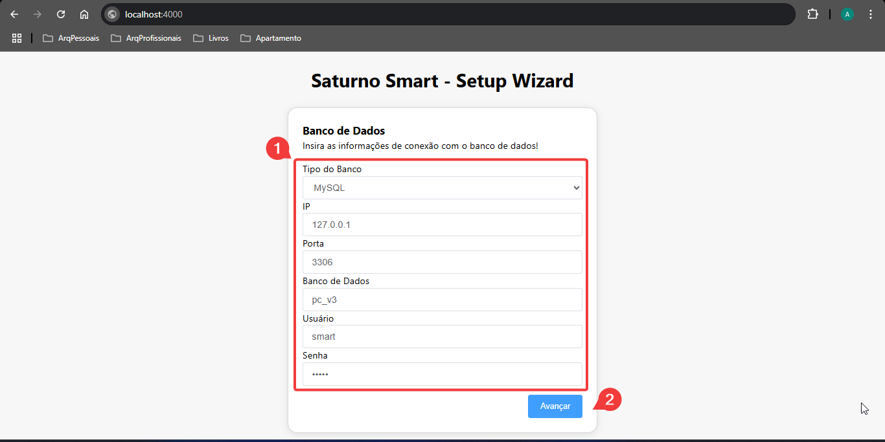
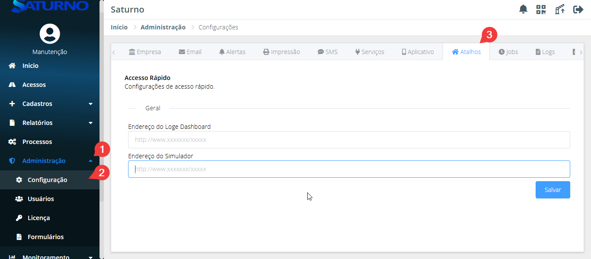
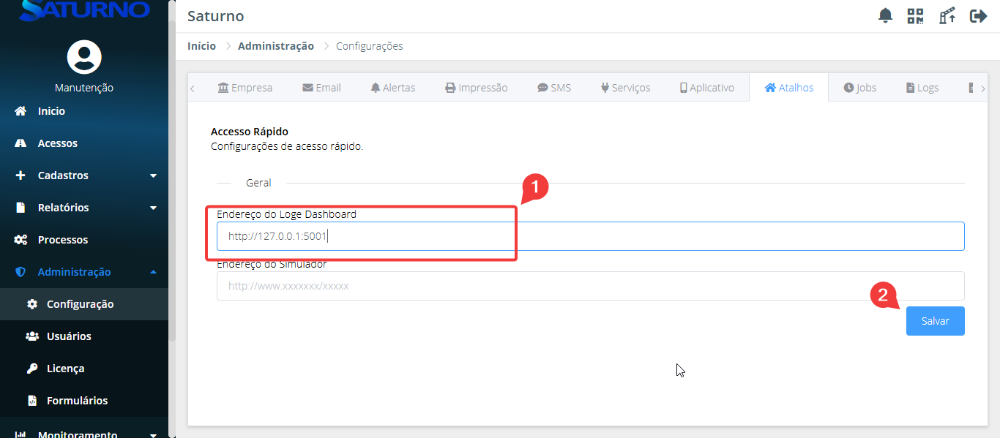
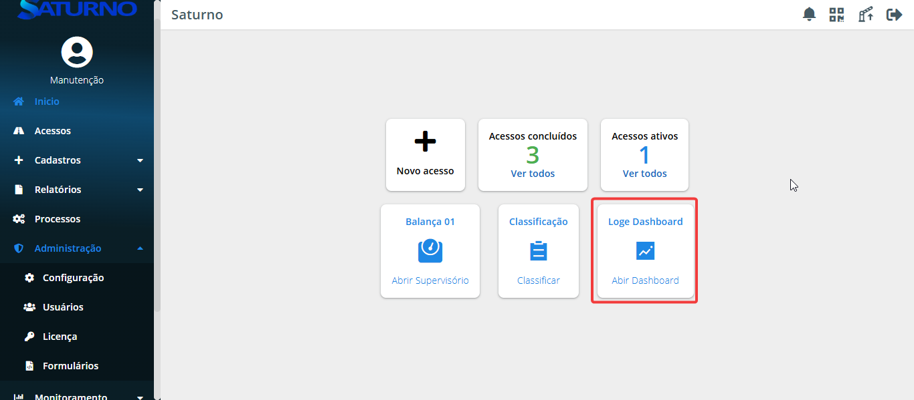

# 🛠 Manual de Instalação

> Versão 2.0 | Atualizado em: 16/05/2025

---

## 📑 Sumário

- [Termos de Uso](#tdu)
- [Introdução](#int)

### ⚙️ [CAPÍTULO 1: DESCRIÇÃO TÉCNICA](#cap1)

- [1.1 Requisitos Minímos](#11-rm)
- [1.2 Arquivos Necessários](#12-an)

### ⚙️ [CAPÍTULO 2: INSTALAÇÃO](#cap2)

- [2.1 Instalação via Setup](#21-ivs)
- [2.3 Instalação via terminal](#22-ivt)

### ⚙️ [CAPÍTULO 3: CONFIGURAÇÕES EXTRAS](#cap3)

- [3.1 Configuração Setup Wizard](#31-sw)

---

## ⚖️ Termos de Uso {#tdu}

Este manual, ou qualquer parte dele, **não pode** ser reproduzido, copiado, modificado ou distribuído sem autorização prévia e expressa da **Saturno Smart**. A Saturno Smart reserva‑se o direito de revisar e aprimorar seus produtos sempre que considerar necessário. Esta publicação reflete o estado do produto na **data de sua emissão** e pode não corresponder a futuras versões ou atualizações.

---

## 🧾 Introdução {#int}

Este manual tem como objetivo orientar o usuário na instalação e configuração inicial do software Ponto de Controle, desenvolvido pela Saturno Smart. Através de instruções passo a passo, serão abordados os requisitos técnicos mínimos, os arquivos necessários para instalação, os métodos disponíveis de instalação (via instalador gráfico ou terminal), bem como a configuração inicial por meio do Setup Wizard.
O conteúdo deste guia é indicado tanto para técnicos de TI quanto para usuários responsáveis pela implantação do sistema nas unidades operacionais. Recomenda-se seguir a ordem dos capítulos para garantir uma instalação correta e completa da aplicação

---

# ⚙️ CAPÍTULO 1: DESCRIÇÃO TÉCNICA {#cap1}

## 📌 1.1 Requisitos Minímos {#11-rm}

Requisitos mínimos para utilização do software Ponto de Controle:
(Smart modelo 1 e 2):

- **Processador:** Intel Core i5-7500 – 4 núcleos / 4 threads
- **Memória RAM:** 8 GB
- **Armazenamento:** 256 GB de disco (espaço livre para instalação e operação do software)

(Smart modelo 3 ou superior):

- **Processador:** Intel Core i5-7500 – 4 núcleos / 4 threads
- **Memória RAM:** 16 GB
- **Armazenamento:** 512 GB de disco (espaço livre para instalação e operação do software)

Sistemas Operacionais Homologados:

- Windows 10 (64 bits)
- Windows 11 (64 bits)
- Windows Server 2016 ou superior (64 bits)

Bancos de Dados Homologados:

- MySQL 8.0 ou superior
- PostgreSQL 2020 ou superior
- Microsoft SQL Server 2020 ou superior

## 📌 1.2 Arquivos Necessários {#12-an}

Os arquivos necessários para a instalação do software estão disponíveis no seguinte caminho:

- **SharePoint:** `https://ibstecn.sharepoint.com/sites/software/Downloads/Forms/AllItems.aspx`

    - **Ponto de Controle:** `Downloads/01. Saturno Smart V5 [Ponto de Controle]`
    - **Saturno Loge:** `Downloads/03. Loge Dashboard`
    - **MySql:** `Ferramentas/mysql-installer-community-8.0.40.0.msi`

---

# ⚙️ CAPÍTULO 2: INSTALAÇÃO {#cap2}

## 📌 2.1 Instalação via Setup {#21-ivs}

Para realizar a instalação do Ponto de Controle por meio do instalador, execute o arquivo `.exe` localizado na pasta referenciada no [tópico 1.2](#12-an).

Na janela exibida, clique em "Próximo".

Leia os termos e condições, e clique em "Eu Concordo" para prosseguir.

Em seguida, defina o local de instalação do software e clique em "Próximo". Caso deseje alterar o diretório padrão, clique em "Procurar" e selecione o novo local.

Nesta etapa, você pode escolher se deseja:

- Criar um atalho na área de trabalho.
- Instalar o MySQL junto com o software.

Marque as opções desejadas e clique em "Próximo".

Se tiver selecionado a instalação do MySQL, será necessário definir a porta e a senha do banco de dados. Após preencher os campos, clique em "Próximo".

Agora, configure a porta de acesso ao software e o nome do serviço que será criado ao final da instalação. Clique em "Instalar" para iniciar o processo.

Mantenha a opção "Iniciar automaticamente com o sistema" marcada para que o serviço seja iniciado junto com o Windows. Por fim, clique em "Concluir".
Após finalizar a instalação, siga os passos descritos no [tópico 3.1](#31-sw).

## 📌 2.2 Instalação via terminal {#22-ivt}

**OBS.:** Antes de prosseguir com a instalação via terminal, certifique-se de que o MySQL já esteja instalado (Caso ainda não tenha feito isso, siga os passos descritos no [tópico 2.3](#23-im)).

Faça o download do arquivo `.zip` localizado na pasta mencionada no [tópico 1.2](#12-an). Em seguida:

1. Descompacte o arquivo.
2. Crie uma pasta no diretório `C:\` com o nome **"SMART"**.
3. Mova o conteúdo extraído para essa nova pasta.

Dentro da pasta `PCV3`, execute o arquivo `smart-control-point`.

O servidor será iniciado. Em seguida, abra uma página no navegador e acesse o endereço `127.0.0.1:4000`. Depois, siga os passos descritos no [tópico 3.1](#31-sw).

## 📌 2.3 Instalação MySql {#23-im}

Faça o download do arquivo `mysql-installer-community-8.0.40.0.msi`, mencionado no [tópicpo 1.2](#12-an). Execute o arquivo `.msi`.

No menu "Choosing a Setup Type", selecione a opção "Custom" e clique em "Next".

No menu "Select Products", expanda as opções de "MySQL Server" e "Applications", transfira os pacotes MySQL Server 8.0.42 e MySQL Workbench 8.0.42, e clique em "Next".

No menu "Check Requirements", clique em "Execute", instale todos os pacotes do Visual C++ exigidos e, ao final, clique em "Next".

No menu "Installation", clique em "Execute" e, após a finalização, clique em "Next".

No menu "Product Configuration", clique em "Next".

No menu "Type and Networking", altere o campo "Config Type" para "Server Computer" e clique em "Next".

No menu "Authentication Method", defina o método de autenticação que será utilizado:

| Método de Autenticação | Nome Técnico | Segurança | Compatibilidade | Observações |
|------------------------|------------------------|------------------|---------------------------|------------------------------------------------------------------------------|
| Legacy Authentication Method | `mysql_native_password`| Baixa a moderada | SSV4 (clientes antigos)   | Compatível com clientes mais antigos (MySQL < 8.0). O Ponto de Controle também aceita esse método. |
| Strong Password Encryption for Authentication | `caching_sha2_password`| Alta | Ponto de Controle | Padrão a partir do MySQL 8.0. Mais seguro, evita tráfego de senha em texto claro. |

No menu "Accounts and Roles", defina a senha do usuário root. Por padrão, a Saturno utiliza a senha `Baloo001`.
Adicione dois usuários chamados **smart** — um com escopo **global** e outro com escopo **local**. Para isso, clique em "Add User"..

Após clicar em "Add User", será exibido um formulário. Preencha da seguinte forma:

- User Name: `smart`
- Host: `%` (para usuário global) ou `localhost` (para usuário local)
- Password: utilize a mesma senha do root (`Baloo001`)
Clique em "OK".

Após adicionar os dois usuários extras, clique em "Next".

No menu "Windows Service", clique em "Next".

No menu "Server File Permissions", clique em "Next".

No menu "Apply Configuration", clique em "Execute" e, ao concluir, clique em "Finish".

## 📌 2.4 Instalação Loge {#24-il}

Faça o download do arquivo `saturno-loge-2.0.5-setup.exe`, mencionado no [tópicpo 1.2](#12-an), e execute o arquivo `.exe`.

Clique em "Próximo".

Clique em "Eu Concordo" para aceitar os termos de licença.

Na etapa de escolha do diretório de instalação:

- Se você optou pela instalação via terminal, selecione a pasta **SMART**, criada no [tópico 2.2](#22-ivt).
- Se você optou pela instalação via setup, selecione a pasta **Saturno**, criada no [tópico 2.1](#21-ivs).

Para isso, clique em "Procurar...", navegue até a pasta desejada e, em seguida, clique em "Próximo".

No menu de configurações de conexão, preencha os campos da seguinte forma:

- **Empresa:** mantenha "Saturno Smart" (valor padrão), ou altere conforme necessidade do cliente.
- **URL DB Ponto de Controle:**

    Altere os parâmetros da URL conforme abaixo:

    - `username`: `root`
    - `password`: `Baloo001`
    - `db_name`: `pc_v3`
    (Caso tenha utilizado credenciais ou nome de banco diferentes, substitua pelos corretos.)
- **URL Ponto de Controle:** `http://localhost:4000`
- **Porta:** por padrão, a porta é 5000. No entanto, alguns clientes utilizam essa porta para o integrador. Nesses casos, altere para 5001:
    - Se o integrador estiver utilizando a porta 5000, defina 5001 aqui.
    - Se o integrador estiver em 5001, mantenha 5000 para o Loge.

    Após preencher todos os campos, clique em "Instalar".

Ao final da instalação, mantenha o checkbox selecionado para que o Loge seja instalado como **serviço do Windows** e clique em "Concluir".

---

# ⚙️ CAPÍTULO 3: CONFIGURAÇÕES EXTRAS {#cap3}

## 📌 3.1 Configuração Setup Wizard {#31-sw}

Após a instalação, será aberta automaticamente uma guia no navegador com o Setup Wizard (Caso a guia não seja aberta, abra o navegador e acesse o endereço `http://localhost:4000`).

Na primeira seção, preencha as informações relacionadas ao banco de dados:

- O banco de dados a ser utilizado
- IP e porta do banco (devem ser os mesmos definidos durante a instalação do MySQL)
- Nome do banco: por padrão, o sistema sugere pc_v3, mas o usuário pode definir outro nome, se desejar.
    - Ao alterar o nome do banco, lembre-se de atualizar também essa informação no arquivo de configuração do Loge.
- Usuário e senha do banco: utilize as credenciais do usuário smart, criado no [tópicpo 2.3](#23-im).

Após a inicialização do banco, será possível:

- Criar um usuário administrador, preenchendo os campos com nome de usuário e senha;
- Ou pular essa etapa, se preferir criar o usuário posteriormente.

Na etapa seguinte, selecione um dos modelos de configuração inicial do sistema e clique em "Avançar":

- **Modelo 1 – Pesagem Simples:** Cria duas rotas (tara e bruto e carregamento) e um ponto de balança já configurado.
- **Modelo 2 – Rotas Padrões:** Cria todas as funcionalidades de cada rota, com balança e portaria pré-configuradas.
- **Modelo em Branco:** Nenhuma rota ou ponto de controle é criado. Ideal para configurações personalizadas.
- **Importar Arquivo:** Permite importar um template de outra unidade, útil para replicar estruturas.
**Obs.:** O template traz rotas e configurações de ponto de controle, mas não inclui dados de cadastros ou acessos.

## 📌 3.2 Configuração de Serviços do Windows {#33-csw}

Caso o Ponto de Controle tenha sido instalado na opção terminal, é necessário realizar a instalação manual do serviço do Windows. Para isso, utilize o arquivo `.bat` fornecido no pacote de instalação.

Siga os passos abaixo:

- Acesse a pasta PCV3 e localize o arquivo `install-service.bat`.
- Clique com o botão direito sobre o arquivo e selecione "Executar como administrador".
- Aguarde a execução e, após aparecer a mensagem "Aperte qualquer tecla para continuar", pressione qualquer tecla e feche o terminal.

## 📌 3.3 Configuração Loge {#34-cl}

Para criar um atalho para o Loge dentro do Ponto de Controle, é necessário configurar a URL base onde o Loge está instalado.

Acesse o Ponto de Controle e navegue até o menu:
"Administração > Configuração > Atalhos".

No campo "Endereço do Loge Dashboard", insira a URL base do Loge, incluindo o prefixo `http://`.
Em seguida, clique em "Salvar".
**OBS.: Atente-se para a porta que foi definida no [tópico 2.4](24-il)**

Após salvar, um atalho para o Dashboard do Loge será exibido na tela inicial do Ponto de Controle.

---
