# 🛠 Manual de Instalação

> Versão 2.0 | Atualizado em: 05/05/2025

---

## 📑 Sumário

- [Termos de Uso](#tdu)
- [Introdução](#int)

### ⚙️ [CAPÍTULO 1: DESCRIÇÃO TÉCNICA](#cap1)

- [1.1 Requisitos Minímos](#11-rm)
- [1.2 Arquivos Necessários](#12-an)

### ⚙️ [CAPÍTULO 2: INSTALAÇÃO](#cap2)

- [2.1 Instalação via Setup](#21-ivs)
- [2.3 Instalação via terminal](#22-ivt)
- [2.3 Setup Wizard](#23-sw)

---

## ⚖️ Termos de Uso {#tdu}

Este manual, ou qualquer parte dele, **não pode** ser reproduzido, copiado, modificado ou distribuído sem autorização prévia e expressa da **Saturno Smart**. A Saturno Smart reserva‑se o direito de revisar e aprimorar seus produtos sempre que considerar necessário. Esta publicação reflete o estado do produto na **data de sua emissão** e pode não corresponder a futuras versões ou atualizações.

---

## 🧾 Introdução {#int}

Este manual tem como objetivo orientar o usuário na instalação e configuração inicial do software Ponto de Controle, desenvolvido pela Saturno Smart. Através de instruções passo a passo, serão abordados os requisitos técnicos mínimos, os arquivos necessários para instalação, os métodos disponíveis de instalação (via instalador gráfico ou terminal), bem como a configuração inicial por meio do Setup Wizard.
O conteúdo deste guia é indicado tanto para técnicos de TI quanto para usuários responsáveis pela implantação do sistema nas unidades operacionais. Recomenda-se seguir a ordem dos capítulos para garantir uma instalação correta e completa da aplicação

---

# ⚙️ CAPÍTULO 1: DESCRIÇÃO TÉCNICA {#cap1}

## 📌 1.1 Requisitos Minímos {#11-rm}

Requisitos mínimos para utilização do software Ponto de Controle:
(Smart modelo 1 e 2):

- **Processador:** Intel Core i5-7500 – 4 núcleos / 4 threads
- **Memória RAM:** 8 GB
- **Armazenamento:** 256 GB de disco (espaço livre para instalação e operação do software)

(Smart modelo 3 ou superior):

- **Processador:** Intel Core i5-7500 – 4 núcleos / 4 threads
- **Memória RAM:** 16 GB
- **Armazenamento:** 512 GB de disco (espaço livre para instalação e operação do software)

Sistemas Operacionais Homologados:

- Windows 10 (64 bits)
- Windows 11 (64 bits)
- Windows Server 2016 ou superior (64 bits)

Bancos de Dados Homologados:

- MySQL 8.0 ou superior
- PostgreSQL 2020 ou superior
- Microsoft SQL Server 2020 ou superior

## 📌 1.2 Arquivos Necessários {#12-an}

Os arquivos necessários para a instalação do software estarão disponíveis no seguinte caminho:

- **Servidor:** `\\192.168.100.100\p_d\21-SOFTWARE\10 - QA\PontoDeControle`

Essa pasta contém:

- Os arquivos de instalação do SSV4
- O instalador do Ponto de Controle
- O pacote do Ponto de Controle compactado

---

# ⚙️ CAPÍTULO 2: INSTALAÇÃO {#cap2}

## 📌 2.1 Instalação via Setup {#21-ivs}

Para realizar a instalação do Ponto de Controle via instalador, execute o arquivo .exe que se encontra na pasta referenciada no [tópico 1.2](#12-an).
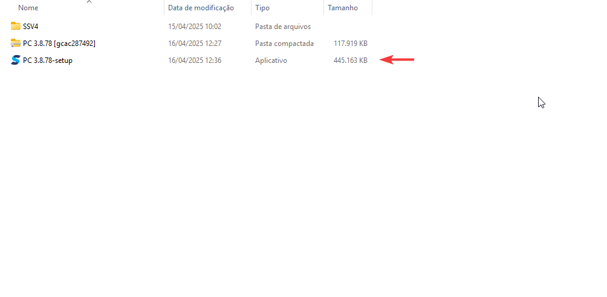

Clique em "Próximo" na janela que for exibida.
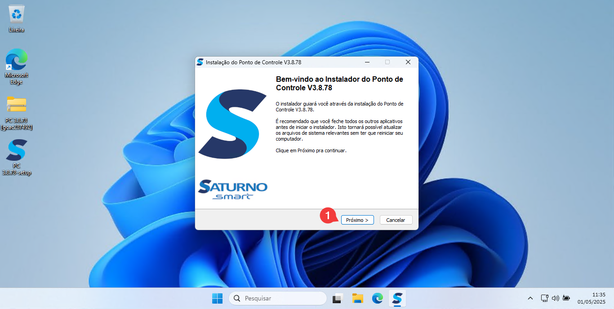

Leia termos e condições, clique em "Eu Concordo".
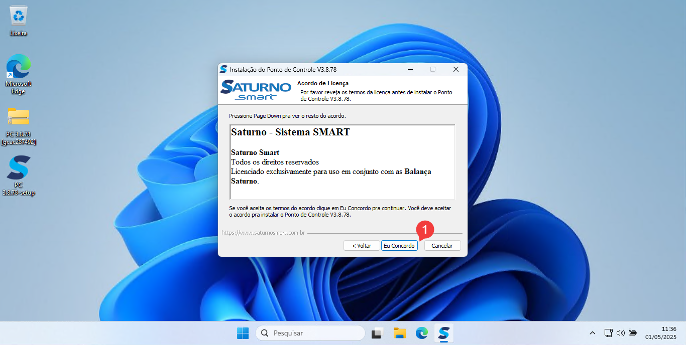

Defina o local de instalação do software e clique em "Próximo". Se desejar alterar o local, clique em "Procurar" e selecione o novo diretório.

Nesta tela, você pode escolher se deseja criar um atalho na área de trabalho e se deseja que o instalador também instale o MySQL. Marque as opções desejadas e clique em "Próximo".

Caso tenha selecionado a instalação do MySQL, defina a porta e a senha do banco de dados, e clique em "Próximo".
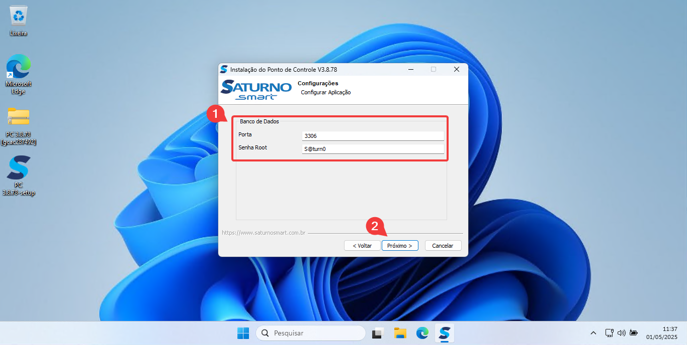

Nesta etapa, defina a porta de acesso ao software e o nome do serviço que será criado ao final da instalação. Clique em "Instalar".
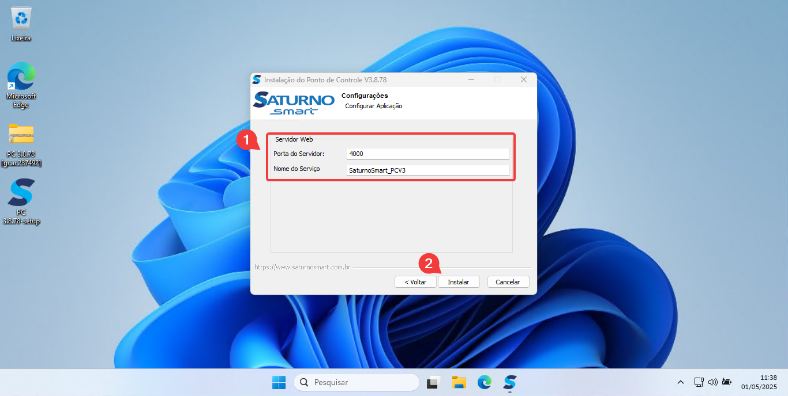

Deixe a opção "Iniciar automaticamente com o sistema" marcada para que o serviço seja instalado e, por fim, clique em "Concluir". Depois, siga os passos descritos no [tópico 2.3](#23-sw).
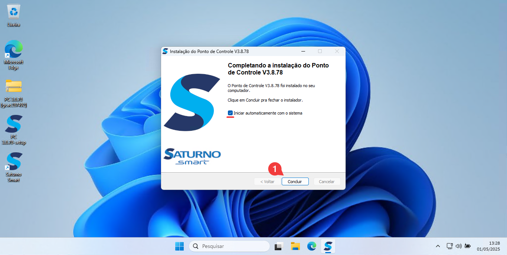

## 📌 2.2 Instalação via terminal {#22-ivt}

Para instalar o Ponto de Controle via terminal, descompacte o arquivo .zip disponível na pasta indicada no [tópico 1.2](#12-an).
**OBS.:** Antes de prosseguir com a instalação, certifique-se de já ter instalado o MySQL.
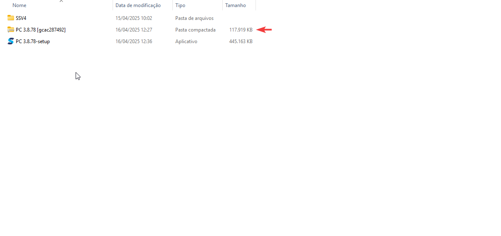

Após descompactar, execute o arquivo `smart-control-point`.
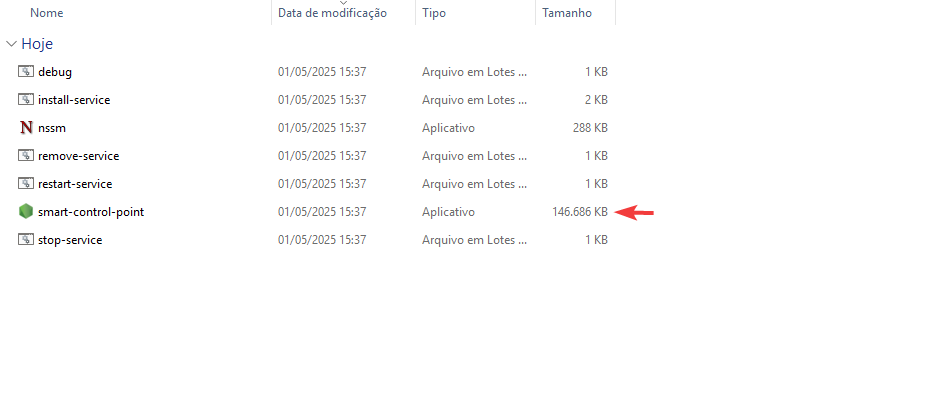

O servidor será iniciado. Em seguida, abra uma página no navegador e acesse o endereço 127.0.0.1:4000. Depois, siga os passos descritos no [tópico 2.3](#23-sw).
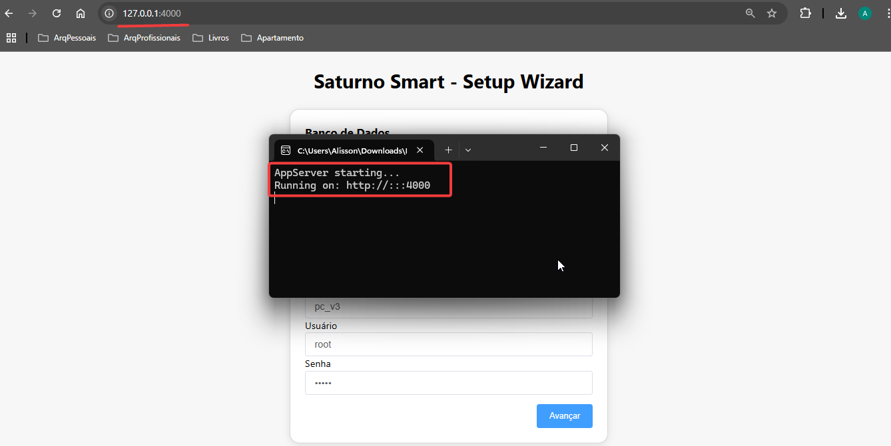

## 📌 2.3 Setup Wizard {#23-sw}

Após a instalação, será aberta uma guia no navegador com o Setup Wizard.

Na primeira seção, defina:

- O banco de dados a ser utilizado
- O IP e porta do banco (Devem ser o mesmo utilizado no momento da instalação do banco)
- O nome do banco
- O usuário e senha
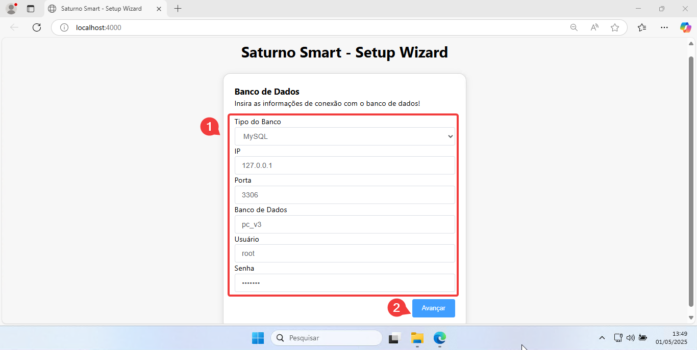

Depois de inicializar o banco, você poderá definir um usuário administrador, preenchendo os campos com usuário e senha, ou poderá optar por pular essa etapa e criar esse usuário mais tarde.
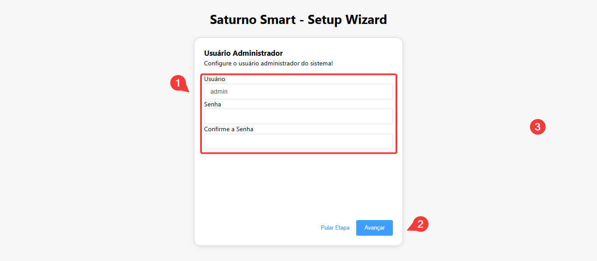

Na etapa seguinte, escolha um dos modelos de configuração inicial para o sistema e clique em "Avançar":

- **Modelo 1 – Pesagem Simples:** Cria duas rotas (tara e bruto; carregamento) e um ponto de balança já configurado.
- **Modelo 2 – Rotas Padrões:** Cria todas as funcionalidades de cada rota, com balança e portaria configuradas.
- **Modelo em Branco:** Nenhuma rota ou ponto de controle é criado. Ideal para customizações.
- **Importar Arquivo:** Permite importar um template de outra unidade, útil para replicar estruturas.
**Obs.:** O template traz rotas e configurações de ponto de controle, mas não inclui dados de cadastros ou acessos.
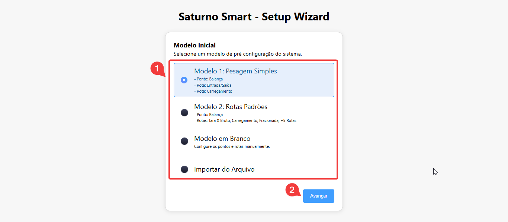

---
