# Manual de Integração

> Versão 1.0 | Atualizado em: 14/05/2025

---

## 📑 Sumário

- [Termos de Uso](#tdu)
- [Introdução](#int)

## [1. Capítulo 1: Integração](#cap1)

   - [1.1 Criando Acessos](#11-a)
   - [1.2 Buscar Acessos](#12-ba)
   - [1.3 Excluir Acessos](#13-ea)

## [2. Capítulo 2: Criar Liberação](#cap2)

   - [2.1 Criacao de Produto](#21-cp)
   - [2.2 Criação de Variedade de Produto](#22-cvp)
   - [2.3 Criação de Safra](#23-cs)
   - [2.4 Criação de Lavoura](#24-cl)
   - [2.5 Criação de Campos](#25-cc)
   - [2.6 Criação de Filial](#26-cf)
   - [2.7 Criação de Liberação](#27-ccl)

---

## ⚖️ Termos de Uso {#tdu}

Este manual, ou qualquer parte dele, **não pode** ser reproduzido, copiado, modificado ou distribuído sem autorização prévia e expressa da **Saturno Smart**. A Saturno Smart reserva‑se o direito de revisar e aprimorar seus produtos sempre que considerar necessário. Esta publicação reflete o estado do produto na **data de sua emissão** e pode não corresponder a futuras versões ou atualizações.

---

## 🧾 Introdução {#int}

Este documento tem como objetivo intruir e guiar o usuário na integração do software Ponto de Controle com ERPs e sistemas de gestão dos clientes. Assim como criação de acessos e cadastros via APIs.

## Capítulo 1: Integração {#cap1}

Para acessar a documentação de APIs do Ponto de Controle, clique na versão do software, que se encontra no canto inferior esquerdo, e em seguida, clique em documentação API.
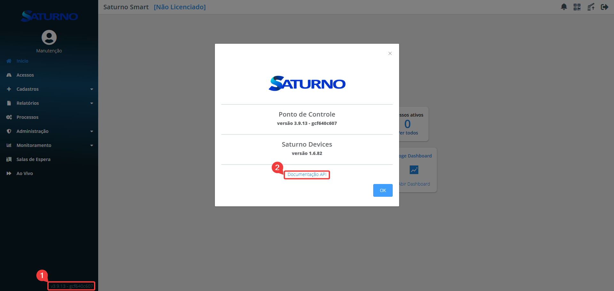

### 1.1 Criando Acessos {#11-a}

Para criar um novo acesso utilize a `API POST /apiv2/access`, primeiro localize esse endpoint na documentação. Em seguida, clique na seta localizada no canto direito do bloco para expandir as opções disponíveis.

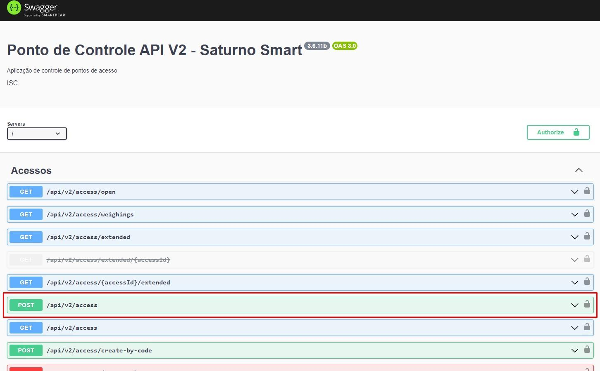

Após expandir, clique no botão “Try it out” para habilitar a edição dos campos. Com os campos liberados, preencha as informações necessárias que serão enviadas ao ponto de controle. Por fim, clique em “Execute” para enviar a requisição e criar o acesso.

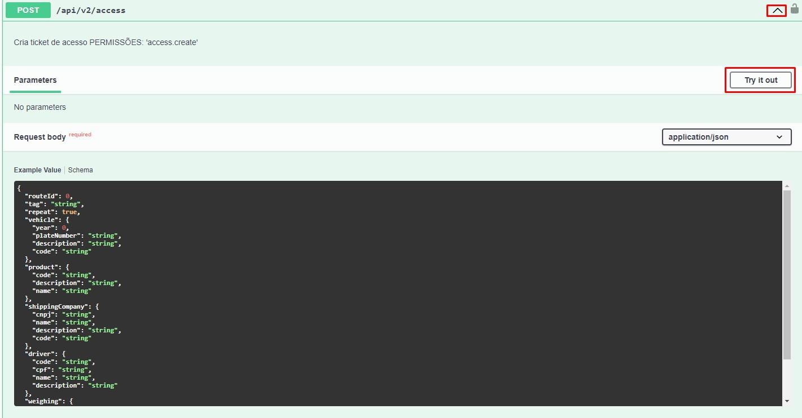

Para configurar corretamente a requisição, é necessário realizar algumas alterações nos campos do corpo da chamada. Primeiro, altere o campo “routeID” utilizando o ID da rota criada dentro do ponto de controle. Para localizar esse ID, acesse o menu de edição da rota no ponto de controle; ele estará visível na URL, conforme imagem de referência.

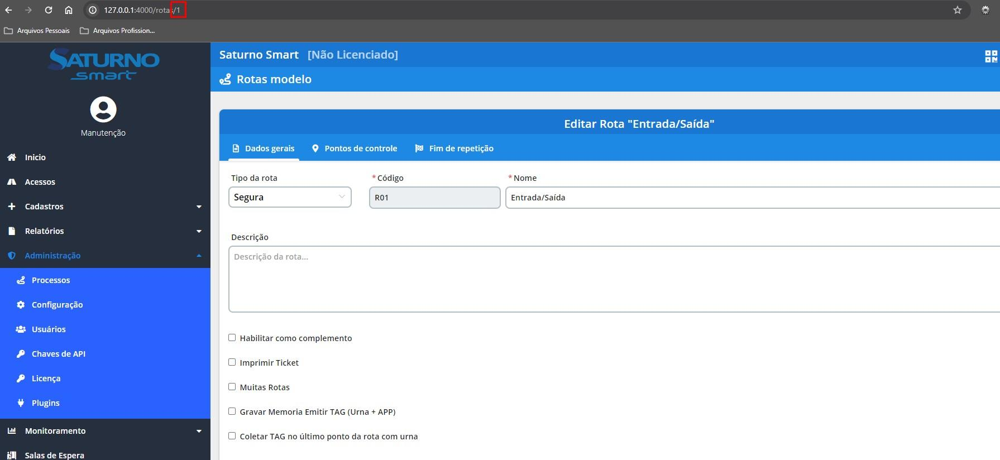

Em seguida, atualize o campo “tag” utilizando uma TAG válida.

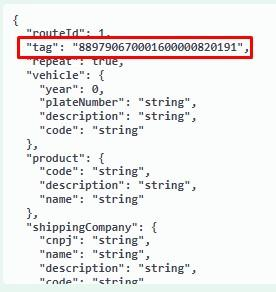

Também é importante verificar o campo “repeat”, que habilita a repetição da rota quando configurado como “true”; caso deseje desabilitar essa funcionalidade, defina-o como “false”.

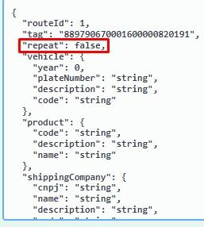

No objeto “Vehicle”, altere o campo “plateNumber” para uma placa válida, conforme exemplo apresentado na imagem.

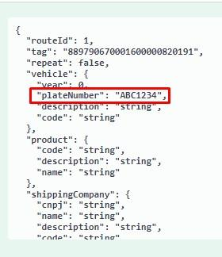

Após realizar todas as alterações mencionadas, clique em “execute” para enviar a requisição.

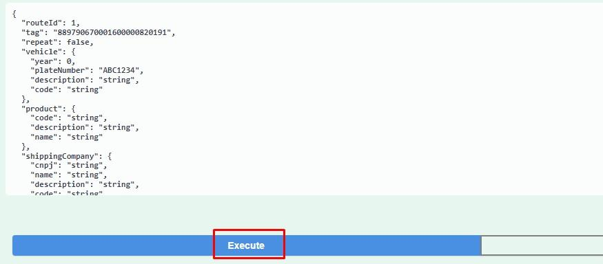

A resposta estará disponível no campo “Server response” e, se bem-sucedida, o servidor retornará o código 200.

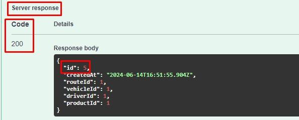

Uma vez concluída a requisição com sucesso, o acesso será criado automaticamente na interface do pontode controle, conforme ilustrado na imagem.

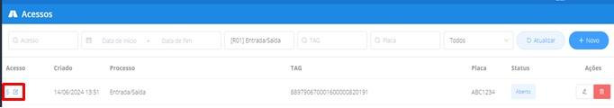

### Capítulo 1.2: Buscar Acessos {#12-ba}

Para consultar os acessos criados, utilize a API GET - `/api/v2/access.`

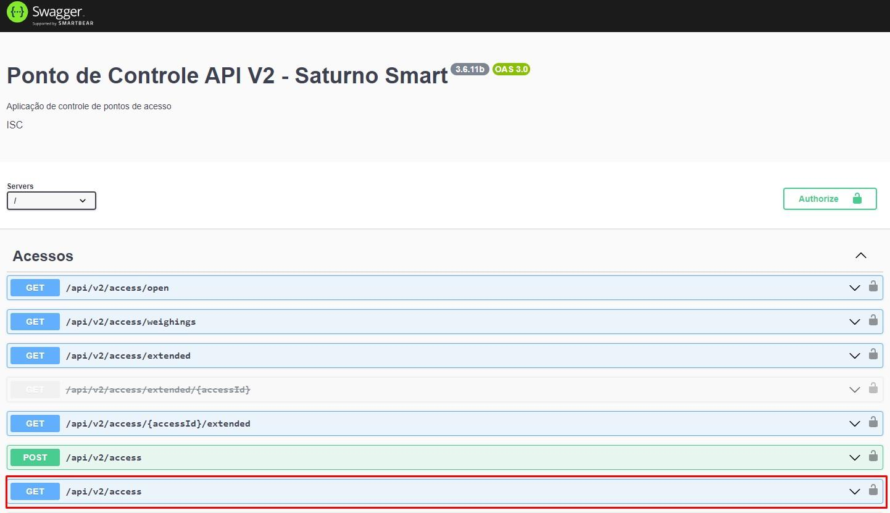

Para isso, clique na seta localizada no canto direito da API e, em seguida, selecione a opção “try it out”.

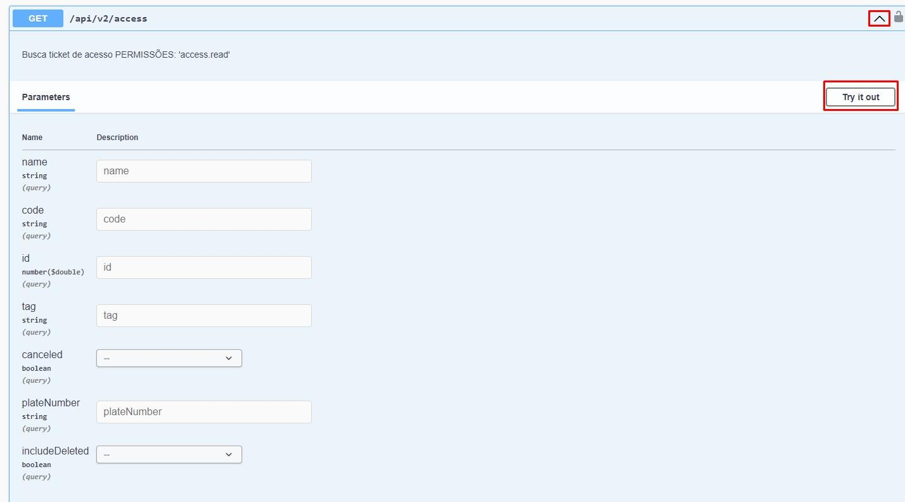

Informe o método desejado para realizar a consulta e clique em “execute”, conforme demonstrado na imagem de referência.

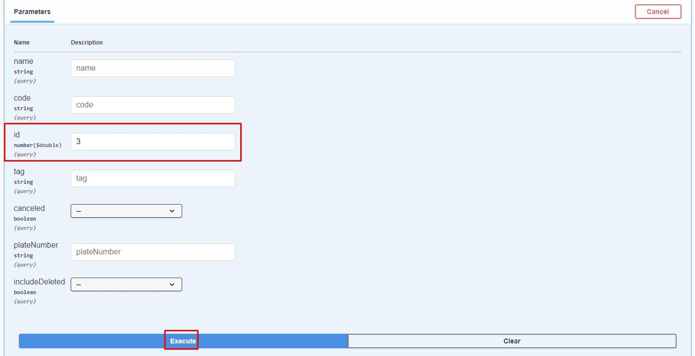
**OBS:** sempre que possível, opte por realizar a busca utilizando o ID do acesso, pois essa abordagem oferece maior precisão nos resultados.

As informações da consulta serão exibidas no menu “Responses” da própria API, conforme ilustrado na imagem correspondente.

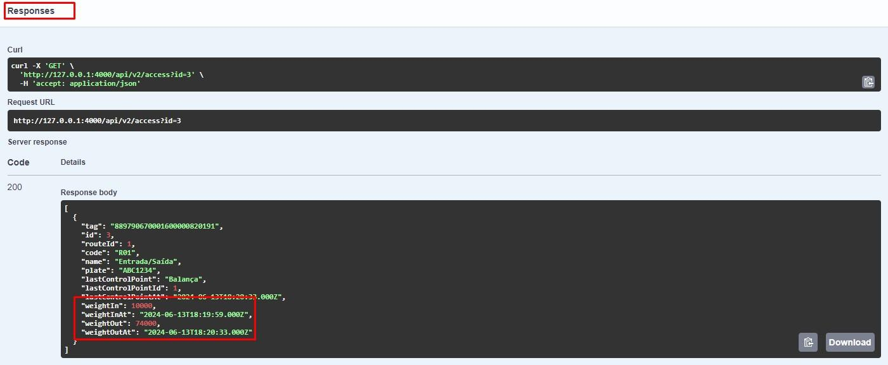

### Capítulo 1.3: Excluir Acessos {#13-ea}

Para deletar um acesso, utilize a API DELETE - `/api/v2/acess/{accessId}`.

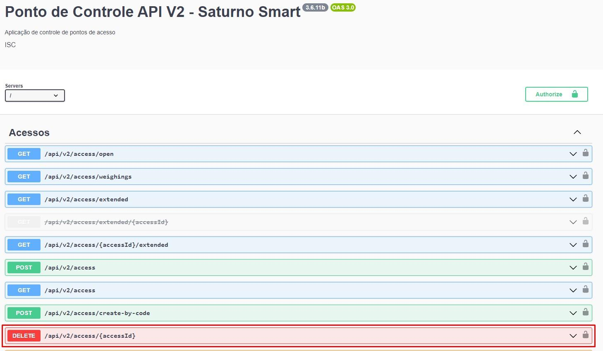

Para isso, clique na seta localizada no canto direito da API e, em seguida, selecione a opção “try it out”.

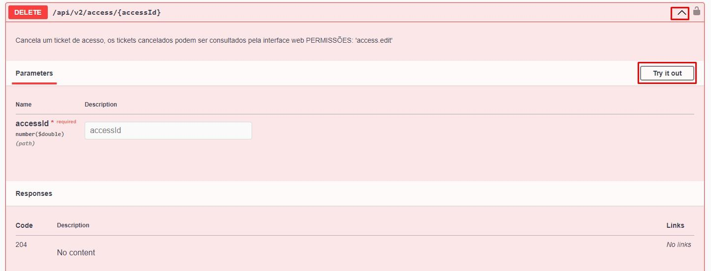

Insira o ID do acesso que deseja remover e clique em “execute” para enviar a requisição.

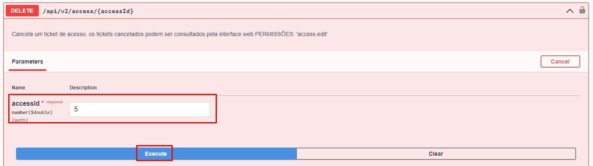

A resposta estará disponível no campo “Server response” e, se a operação for bem-sucedida, o servidor retornará o código 204.

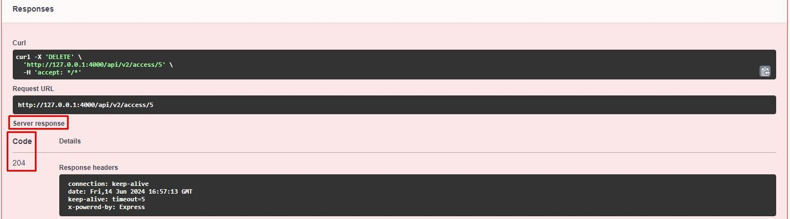

Após a conclusão da requisição, o acesso será excluído da interface do ponto, conforme ilustrado na imagem de referência.
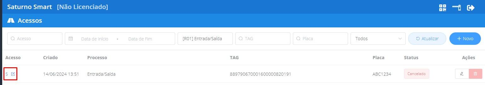

## Capitulo 2: Criação de Liberação {#cap2}

Para criar uma liberação, antes é necessário criar:

- Produto
- Variedade de Produto
- Lavoura
- Safra
- Campo
- Filial

Para criar os itens citados acima, clique na versão do software, que se encontra no canto inferior esquerdo, e em seguida, clique em documentação API.

Na URL da documentação, altere de `http://127.0.0.1:4000/api/v2/docs/` para `http://127.0.0.1:4000/api/v2/docs-internal/`

**OBS:** O IP e porta da URL varia de acordo com o local de instalação do software.

### 2.1 Criação de Produto {#21-cp}

Para criar um produto, acesse a API POST - `/api/v2/product` e clique na seta localizada no canto direito da API e, em seguida, selecione a opção “try it out”.

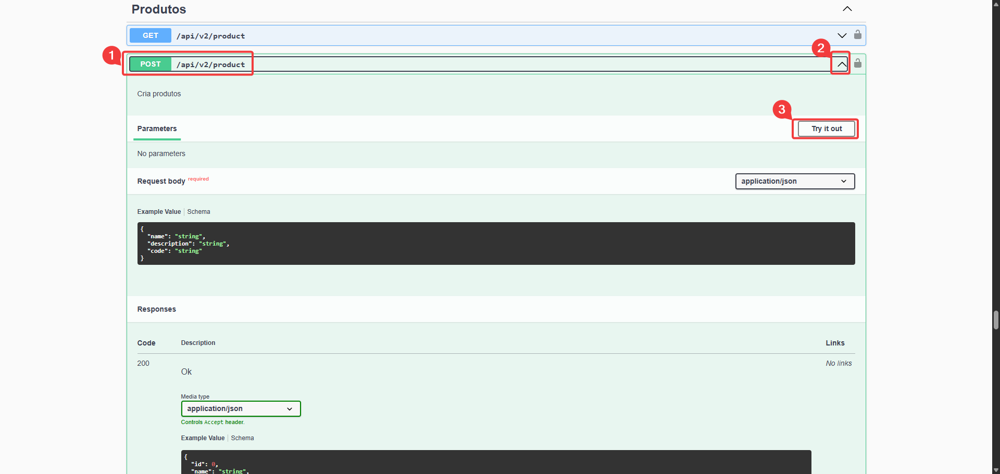

Preencha os campos conforme a necessidade e clique em “execute” para enviar a requisição.

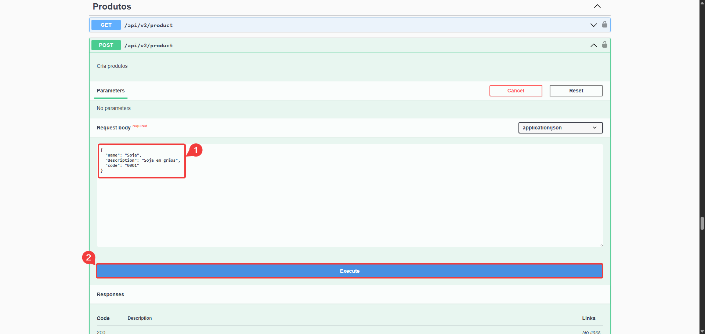

A resposta estará disponível no campo “Server response” e, se bem-sucedida, o servidor retornará o código 200. No campo “Response Body” serão exibidas as informações do produto criado, incluindo o ID que será usado para criar a liberação.

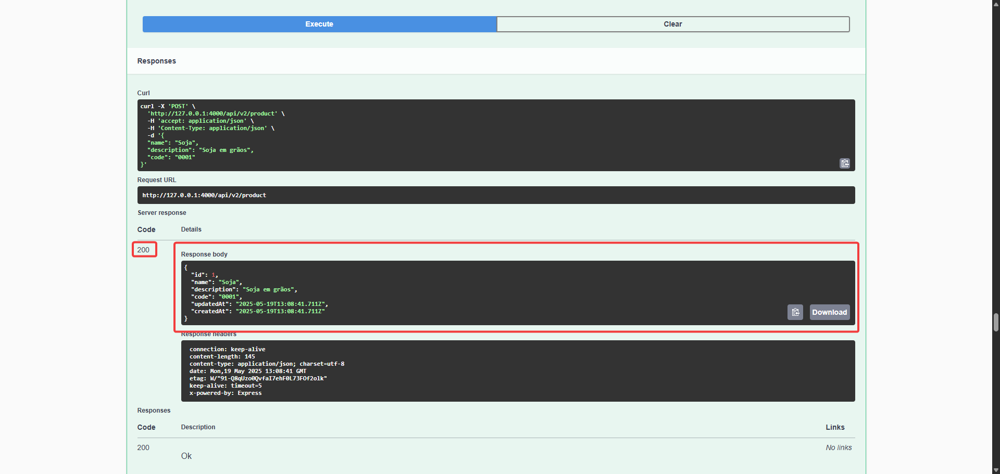

### 2.2 Criação de Variedade de Produto {#22-cvp}

Para criar uma variedade de produto, acesse a API PUT - `/api/v2/product/{productId}/variety` e clique na seta localizada no canto direito da API e, em seguida, selecione a opção “try it out”.

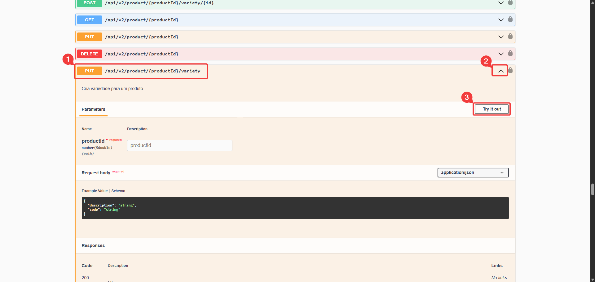

Preencha os campos conforme a necessidade e clique em “execute” para enviar a requisição. O campo "productID" deve ser preenchido com o ID do produto criado anteriormente.

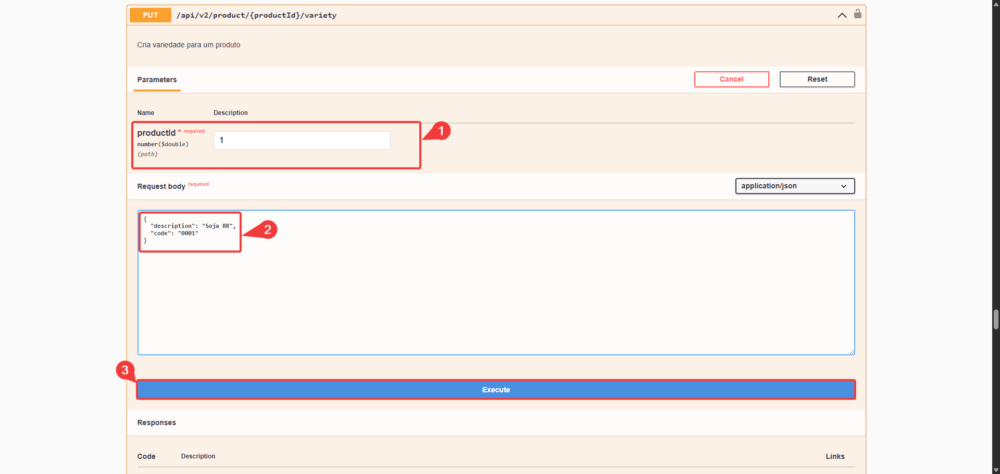

A resposta estará disponível no campo “Server response” e, se bem-sucedida, o servidor retornará o código 200. No campo “Response Body” serão exibidas as informações da variedade de produto criada, incluindo o ID que será usado para criar a liberação.

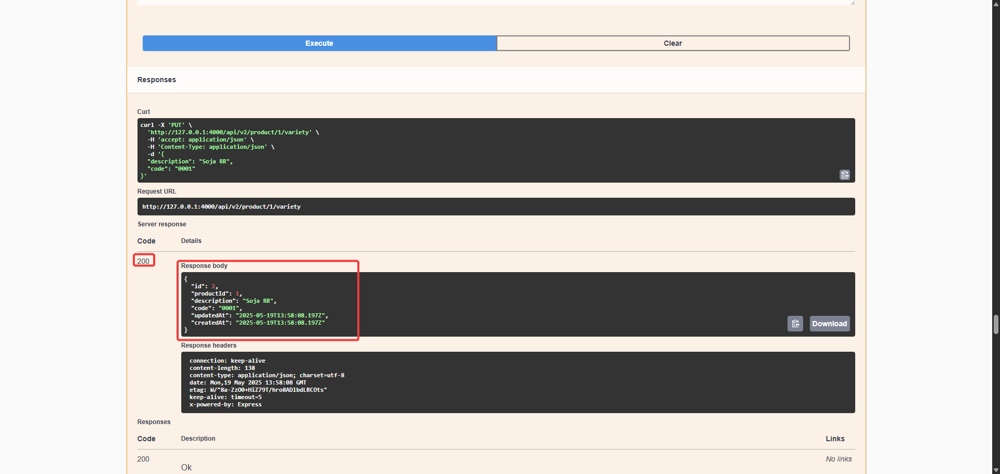

### 2.3 Criação de Safra {#23-cs}

Para criar uma safra, acesse a API POST - `/api/v2/harvest` e clique na seta localizada no canto direito da API e, em seguida, selecione a opção “try it out”.

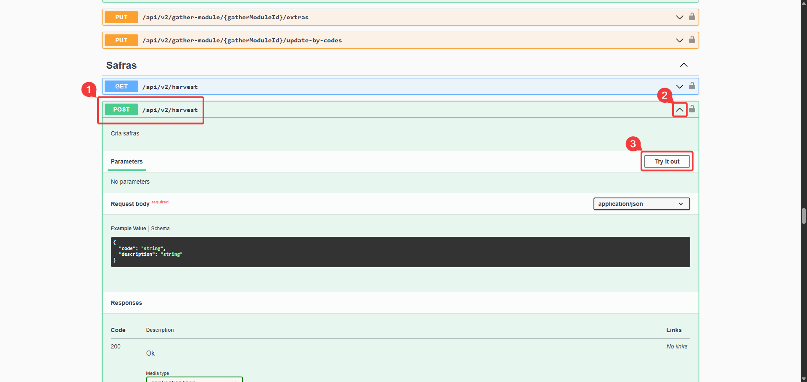

Preencha os campos conforme a necessidade e clique em “execute” para enviar a requisição.

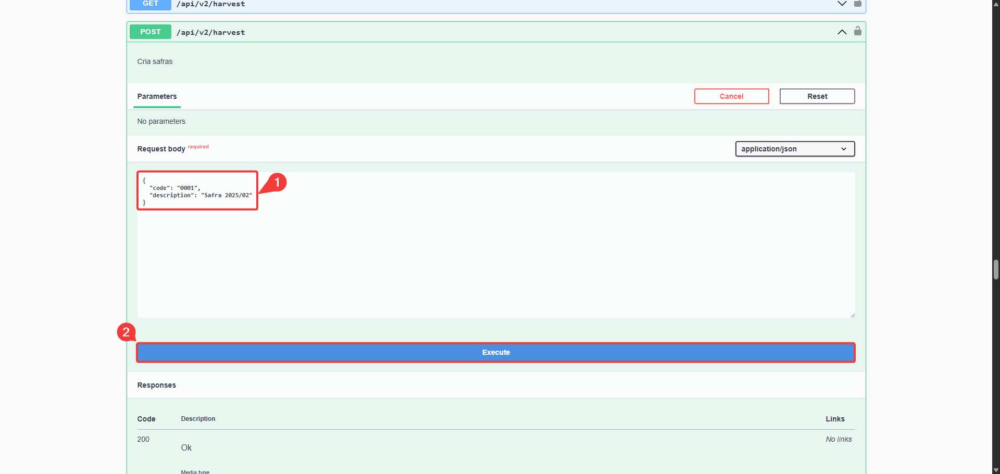

A resposta estará disponível no campo “Server response” e, se bem-sucedida, o servidor retornará o código 200. No campo “Response Body” serão exibidas as informações da safra criada, incluindo o ID que será usado para criar a liberação.

### 2.4 Criação de Lavoura {#24-cl}

Para criar uma lavoura, acesse a API POST - `/api/v2/tillage` e clique na seta localizada no canto direito da API e, em seguida, selecione a opção “try it out”.

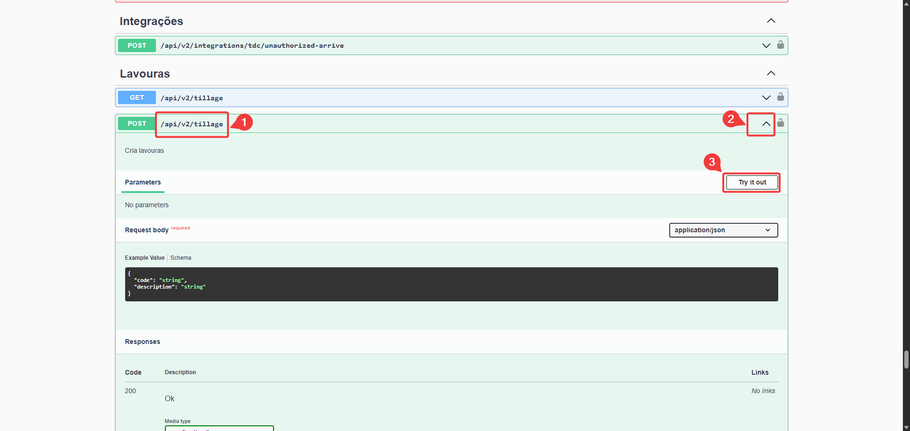

Preencha os campos conforme a necessidade e clique em “execute” para enviar a requisição.

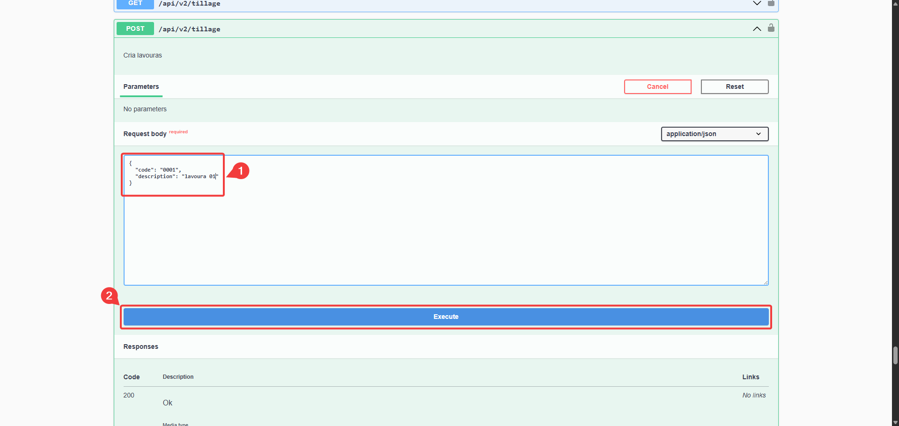

A resposta estará disponível no campo “Server response” e, se bem-sucedida, o servidor retornará o código 200. No campo “Response Body” serão exibidas as informações da safra criada, incluindo o ID que será usado para criar a liberação.

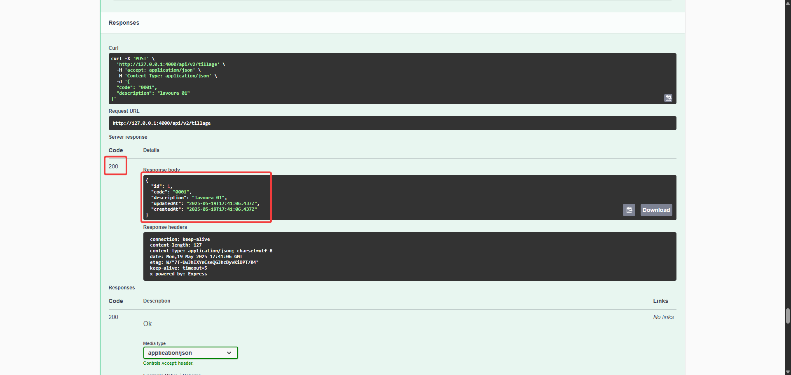

### 2.5 Criação de Campo {#25-cc}

Para criar um campo, acesse a API POST - `/api/v2/field` e clique na seta localizada no canto direito da API e, em seguida, selecione a opção “try it out”.

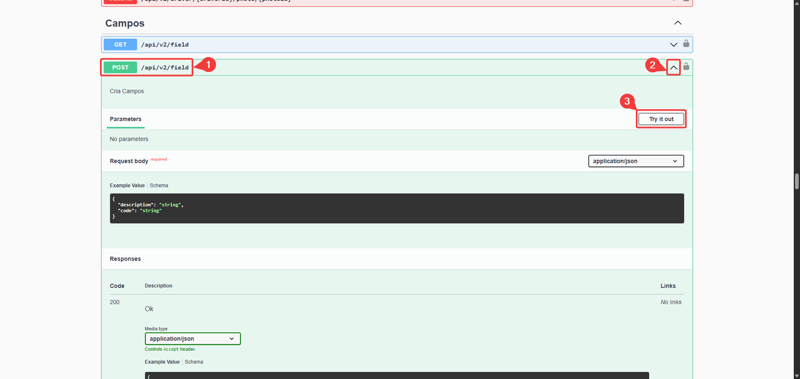

Preencha os campos conforme a necessidade e clique em “execute” para enviar a requisição.

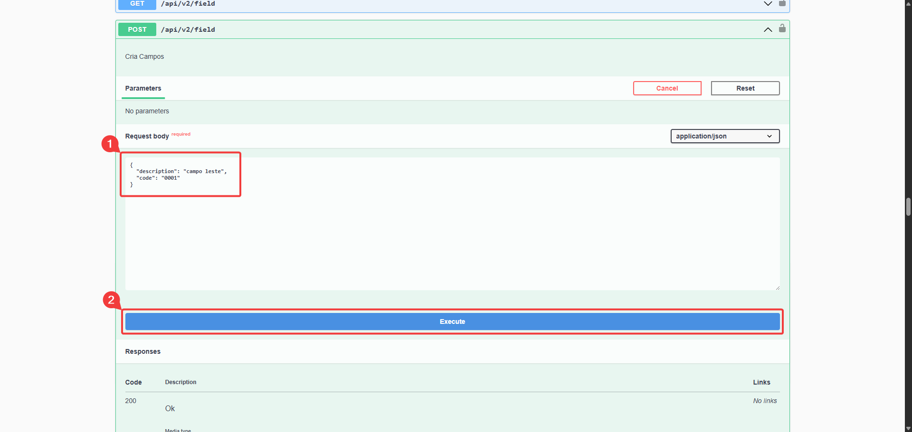

A resposta estará disponível no campo “Server response” e, se bem-sucedida, o servidor retornará o código 200. No campo “Response Body” serão exibidas as informações do campo criado, incluindo o ID que será usado para criar a liberação.

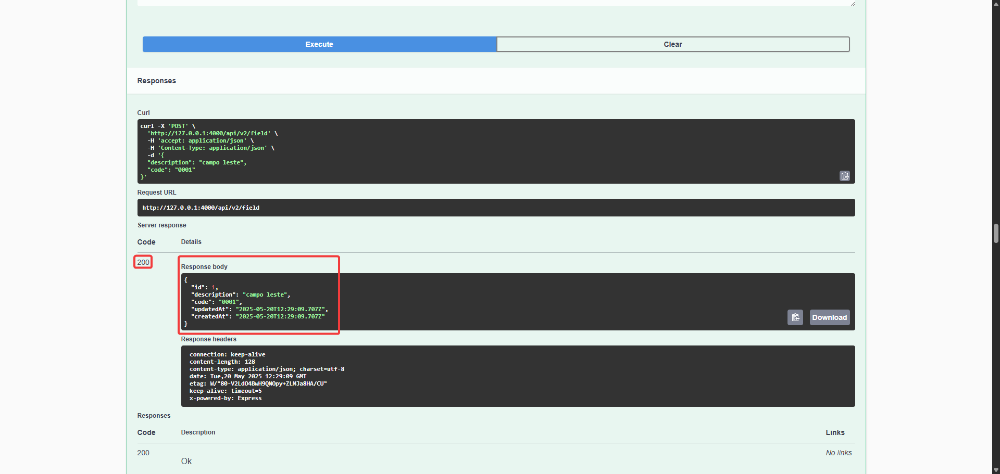

### 2.6 Criação de Filial {#26-cf}

Para criar uma filial, acesse a API POST - `/api/v2/company` e clique na seta localizada no canto direito da API e, em seguida, selecione a opção “try it out”.

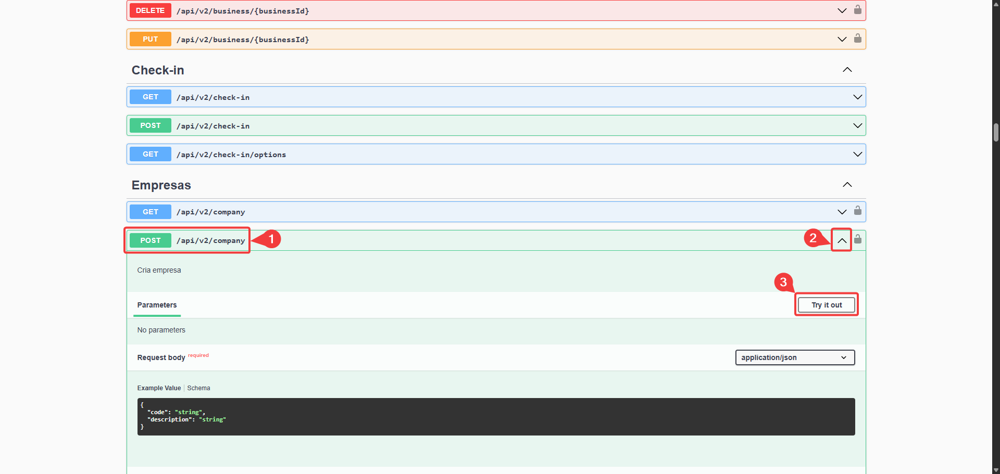

Preencha os campos conforme a necessidade e clique em “execute” para enviar a requisição.

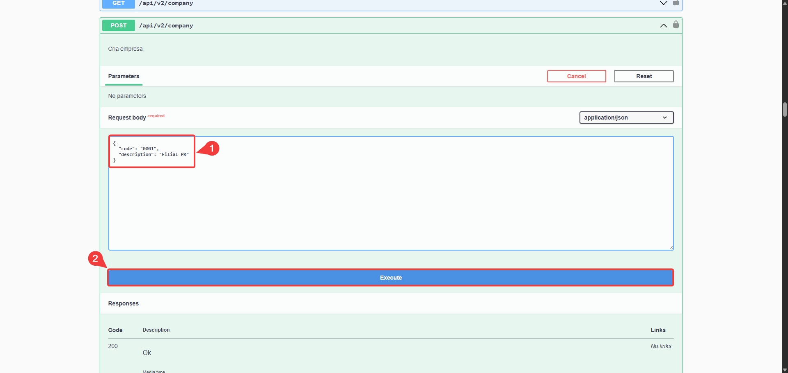

A resposta estará disponível no campo “Server response” e, se bem-sucedida, o servidor retornará o código 200. No campo “Response Body” serão exibidas as informações da filial criada, incluindo o ID que será usado para criar a liberação.

### 2.7 Criação de Liberação {#27-ccl}

Para criar uma liberação, acesse a API POST - `/api/v2/gather-module` e clique na seta localizada no canto direito da API e, em seguida, selecione a opção “try it out”.

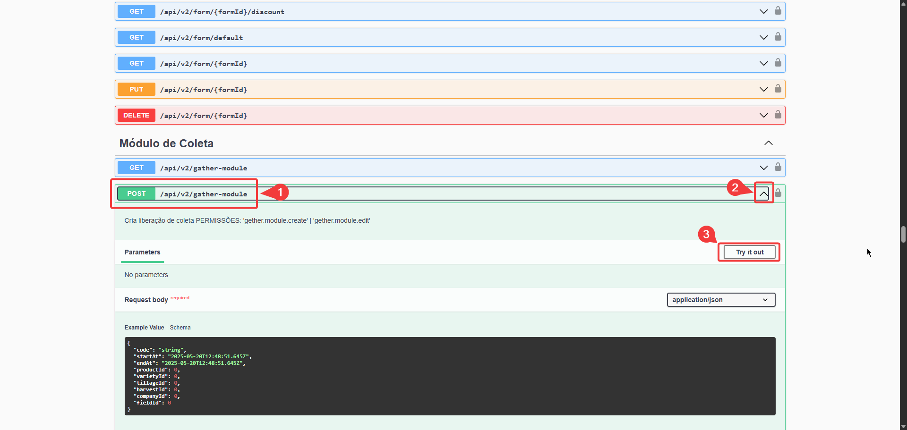

Preencha os campos indicando os IDs dos produtos, variedades, safra, lavoura, campo e filial desejados e clique em “execute” para enviar a requisição. Além disso também é possível alterar as datas de início e fim da liberação, o campo "startAt" indica a data de início da liberação e o campo "endAt" indica a data de fim da liberação.

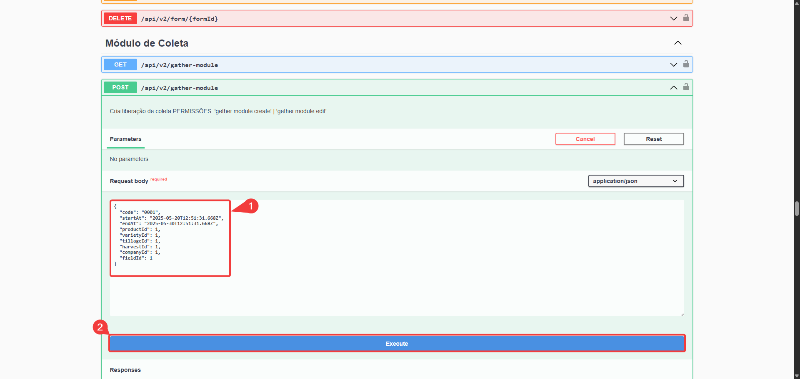

A resposta estará disponível no campo “Server response” e, se bem-sucedida, o servidor retornará o código 200. No campo “Response Body” serão exibidas as informações da liberação criada.

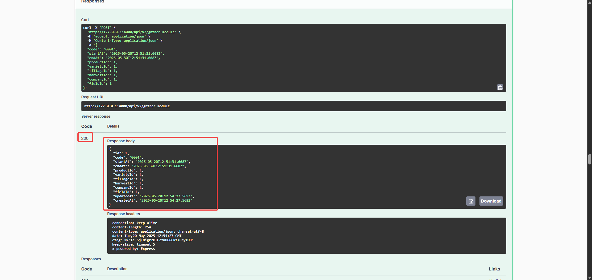
