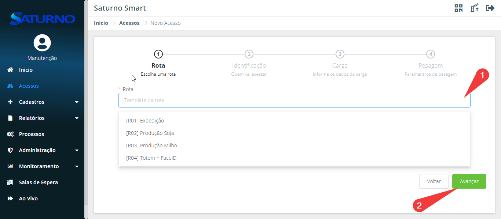
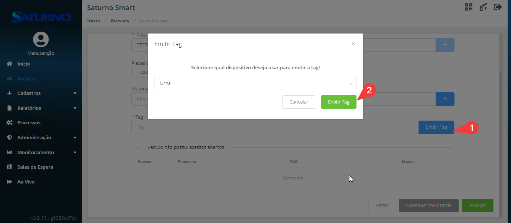
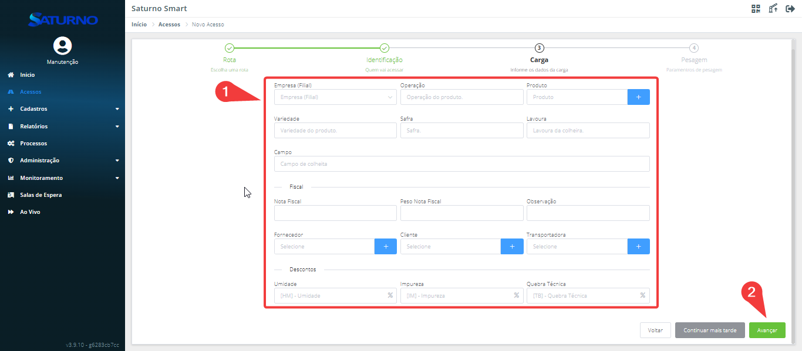
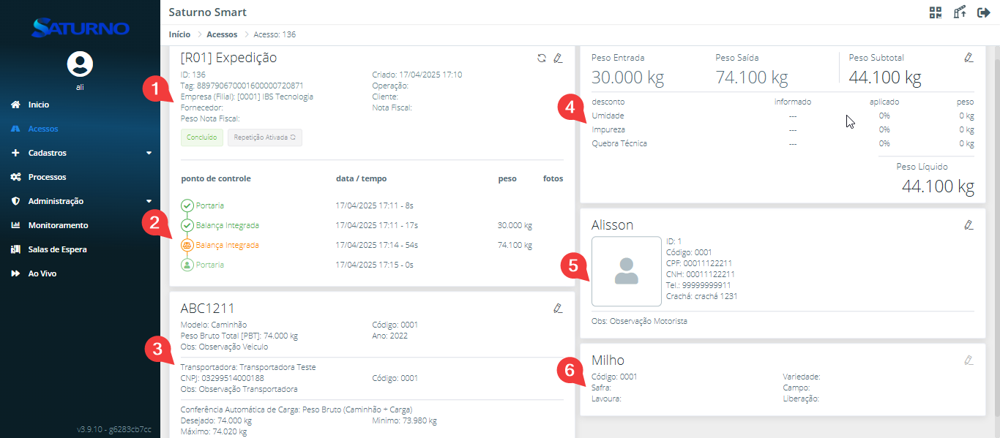
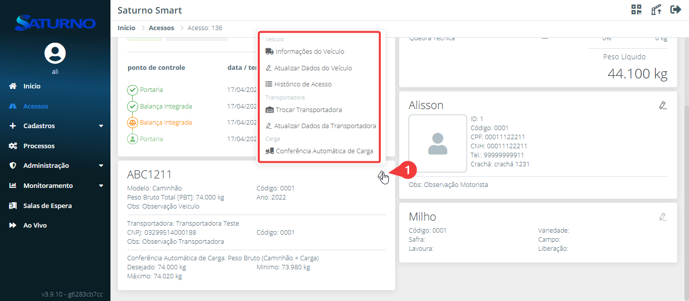
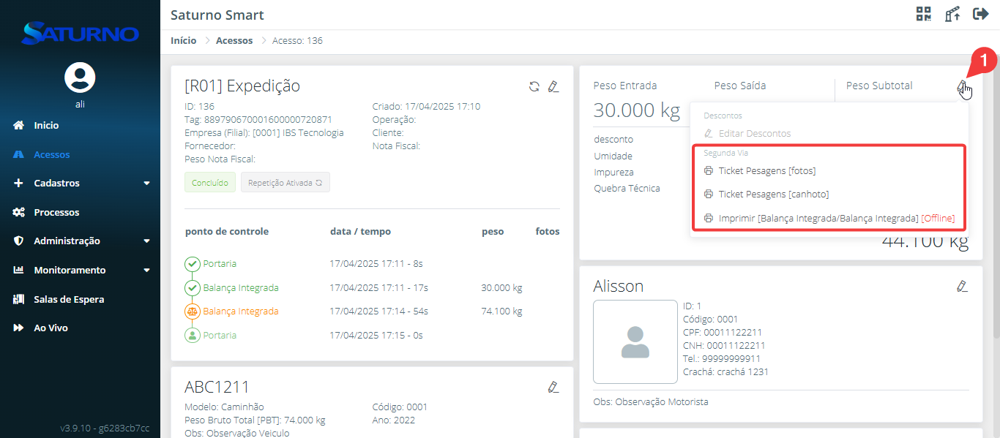
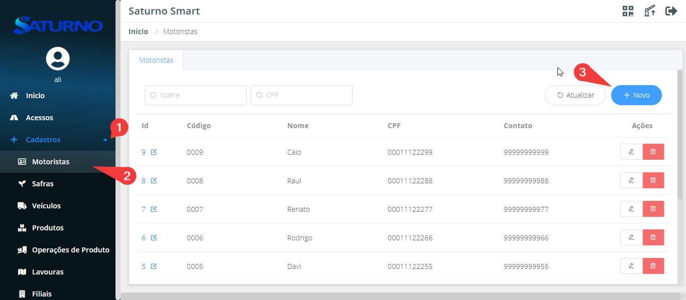
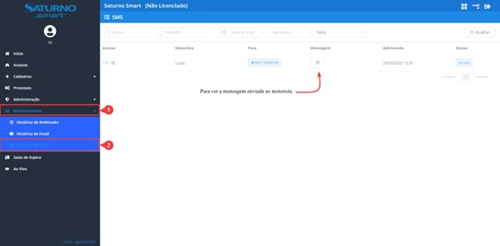

# 🛠 Manual do Operador

> Versão 1.0 | Atualizado em: 16/04/2025

---

## 📌 Sumário

1. [Introdução](#introdução)
2. [Acesso ao Sistema](#acesso-ao-sistema)
3. [Realizando uma Pesagem](#realizando-uma-pesagem)
4. [Tela do Supervisório](#tela-do-supervisório)
5. [Erros Comuns e Soluções](#erros-comuns-e-soluções)
6. [Contato e Suporte](#contato-e-suporte)

---

## ⚖️ Termos de Uso
Este manual, ou qualquer parte dele, **não pode** ser reproduzido, copiado, modificado ou distribuído sem autorização prévia e expressa da **Saturno Smart**. A Saturno Smart reserva‑se o direito de revisar e aprimorar seus produtos sempre que considerar necessário. Esta publicação reflete o estado do produto na **data de sua emissão** e pode não corresponder a futuras versões ou atualizações.

---

## 🧾 Introdução
Este documento tem como finalidade instruir e guiar o operador na utilização adequada do software Ponto de Controle, abordando todas as funcionalidades que fazem parte do respectivo perfil de usuário, a fim de garantir a plena operação. 

---

# ⚙️ CAPÍTULO 1: ACESSOS

## 📌 1.1 Criação do acesso
Após acesso a ferramenta, o operador pode criar um novo acesso de duas maneiras:

- Através do menu Inicio, clique em "Novo Acesso"

- Através do menu Acessos, clique em "+ Novo"

**OBS:** Os cadastros de Motoristas, Safras, Veículos, Produtos, Operações, Lavouras, Filiais, Transportadora e Parceiros a serem utilizados na criação do acesso podem ser criados atráves do menu "Cadastro", acesso Capitulo 2.

## 📌 1.2 Seleção da Rota
Após iniciar o processo de criação de acesso, conforme descrito no passo anterior, o usuário deverá selecionar a rota. A rota é utilizada para definir qual será o processo e quais pontos o usuário precisará seguir e executar dentro da unidade.

### 📍 1.2.1 Rotas padrão
O sistema possui algumas rotas que são definidas por padrão no momento da instalação. As rotas podem ser modificadas e criadas de acordo com a necessidade do cliente. Dentre as rotas padrão estão:

#### 📍 1.2.1.1 Pesagem Tara x Bruto 
A pesagem Tara x Bruto é o método padrão de pesagem, no qual consiste em tirar a tara do caminhão seja com o peso cheio ou vazio do caminhão e na segunda pesagem se tira  a diferença do mesmo, sobrando assim o peso líquido.

#### 📍 1.2.1.2 Pesagem Fracionada
A rota fracionada é utilizada quando um veículo transporta mais de um produto. Nesse caso, o software é capaz de identificar o peso de cada produto individualmente.

#### 📍 1.2.1.3 Pesagem Avulsa
A pesagem avulsa é um método simples que consiste em realizar uma única pesagem, medindo apenas o peso bruto, sem a aplicação de qualquer tara. 

#### 📍 1.2.1.4 Pesagem Carregamento
Esse método consiste em realizar o carregamento da carga com o caminhão em cima da balança. Ou seja, o mesmo acesso fará a tara e iniciará o processo de carregamento. Após finalizado, será realizada a pesagem do bruto — todo esse processo ocorre sem que o caminhão saia da balança. A finalização pode ser feita de duas formas: manualmente, com o operador selecionando a conclusão da operação no botão de "Concluir carregamento", ou automaticamente, por meio da definição de uma conferência de carga na criação do acesso.

#### 📍 1.2.1.5 Pesagem Atualiza Tara
Esse método de pesagem tem como objetivo registrar uma tara para o veículo, que será aplicada automaticamente em pesagens futuras. Caso seja necessário adicionar uma tara extra além da registrada automaticamente, consulte o Capítulo 2.

#### 📍 1.2.1.6 Pesagem Utiliza Tara
Esse método de pesagem tem como função utilizar a tara de algum veículo estabelecido anteriormente, como demonstrado no tópico Pesagem Atualiza Tara ou que tenha sido definida pelo usuário.

#### 📍 1.2.1.7 Passagem Livre
O método de passagem livre é utilizado quando uma balança é usada como uma portaria, em que será realizada a leitura da tag, abrirá as cancelas e quando a balança for zerada, as cancelas fecharão novamente. 

#### 📍 1.2.1.8 Pesagem Livre
O método de pesagem livre apenas pesa o veículo com as cancelas abertas e exibe o peso capturado no display. Não é armazenado o peso do veículo.

## 📌 1.3 Identificação 
Neste formulário estão as informações de identificação de quem irá acessar a unidade. Preencha o formulário de acordo com a necessidade.
**OBS:** Os Campos que possuem "*" são de caráter obrigatório.

### 🔖 1.3.1 Tag
A **Tag** é um cartão magnético que será lido via RFID, identificando automaticamente o acesso que está sendo criado. O preenchimento deste campo pode ser feito de três formas: manualmente (digitando o número da tag), utilizando o leitor de mesa ou por meio da urna eletrônica.

#### 1.3.1.1 Leitura da Tag com leitor de mesa
Para utilizar o leitor de mesa, posicione o cursor do mouse sobre o campo **"Tag"** e aproxime a tag física do leitor.  

#### 1.3.1.2 Emissão da Tag via urna
Para utilizar a urna, clique em **"Emitir Tag"**, selecione a urna desejada (caso existam múltiplas opções) e clique novamente em **"Emitir Tag"** para concluir a emissão.  

## 📌 1.4 Carga
Neste formulário estão as informações da carga transportada pelo veículo. Preencha o formulário de acordo com a necessidade.
**OBS:** Os Campos que possuem "*" são de caráter obrigatório.

## 📌 1.5 Pesagem
Neste formulário devem ser definidos os parâmetros da pesagem, incluindo a opção de utilizar ou não a conferência de carga. Após realizar essa definição, clique em "Avançar" para prosseguir.

### 📦 1.5.1 Conferência de Carga
A conferência de carga é um procedimento que estabelece um peso desejado e uma tolerância específica. Assim, o veículo só é liberado para saída se o peso estiver dentro dos limites pré-definidos. Esse processo pode ser realizado de três maneiras:

- Peso Bruto: Considera a soma do peso do caminhão e da carga.
- Peso Subtotal: Desconsidera o peso do veículo e avalia apenas o peso da carga.
- Peso Líquido: Confere o peso da carga após aplicação dos descontos selecionados.

**OBS:** Este processo pode ser automatizado utilizando a funcionalidade de Regras, ou seja, sem a interferência humana baseando-se em informações do sistema.

### 📦 1.5.2 Criação do acesso com Conferência de Carga
Para criar um acesso com conferência de carga, o usuário deve selecionar um dos modos de conferência no formulário "Pesagem". Após isso, é necessário preencher o campo Valor Desejado, conforme o modo escolhido; Bruto: preencher com o valor do peso bruto esperado. Subtotal: preencher com o peso da carga antes dos descontos. Líquido: preencher com o peso final da carga, já descontados os valores de perdas ou abatimentos.
Além disso, no campo de Tolerância, deve-se definir os valores mínimo e máximo permitidos de variação para o peso, indicando a margem de erro aceitável em relação ao valor desejado.

## 📌 1.6 Visualização dos Acessos
No menu "Acessos", o operador pode visualizar todos os acessos criados no sistema, obtendo uma visão geral das informações e do estado de cada um, que pode ser "Aberto", "Concluído" ou "Cancelado". Para acessar o menu, basta clicar em "Acessos" na barra lateral.

É possível filtrar os acessos através da barra superior. Os filtros podem ser feitos por: ID do acesso, intervalo de datas, processo, TAG, placa do veículo e status do acesso.

### 📝 1.6.1 Visualização dos Acessos individual
Para visualizar individualmente um acesso, clique no ícone de lápis ou no número do acesso. 

Na visualização individual de um acesso, é possível consultar informações detalhadas sobre ele:

- **Seção 1:** exibe dados do processo ao qual o acesso foi designado, como estado, tag, data de criação, entre outros.

  - **Relatórios:** É possível visualizar os tickets do acesso: um contendo as fotos da pesagem, outro com os canhotos, e outro com dados das portarias, também com imagens.  
    No **Histórico de eventos**, são listadas todas as alterações feitas no acesso. 
  

- **Seção 2:** mostra os pontos da rota e seus respectivos status:

  - ✅ **Verde com check:** ponto concluído com sucesso.
  - ⚖️ **Laranja com balança:** divergência de carga.
  - 🧍 **Verde com boneco:** ponto concluído manualmente por um usuário.

- **Seção 3:** apresenta informações do veículo, transportadora e parâmetros da pesagem.

  - **Veículo:** permite visualizar os dados em detalhes e editar as informações do cadastro (exceto a placa, que não pode ser alterada).  
  - **Transportadora:** é possível alterar a transportadora ou atualizar os dados da atual.  
  - **Carga:** permite editar os dados da conferência de carga. O procedimento segue o descrito no tópico 1.5.1.  
    **OBS:** para que essa alteração tenha efeito, ela deve ser feita antes da segunda pesagem.  
  

- **Seção 4:** exibe os dados da pesagem.

  - **Segunda via:** permite emitir a segunda via dos tickets e do ticket térmico (selecione a impressora desejada, caso haja mais de uma).
    

- **Seção 5:** traz as informações do motorista.

  - É possível visualizar os dados em detalhes e alterar o motorista ou atualizar suas informações associadas ao acesso.

- **Seção 6:** contém os dados do produto.

---

# ⚙️ CAPÍTULO 2: CADASTROS

## 📌 2.1 Criação do Cadastros
Para criar os cadastros utilizados na criação do acesso, acesse o menu "Cadastro", localizado na barra lateral.

### 📝 2.1.1 Cadastro do Motorista
No menu “Cadastros”, no submenu “Motoristas”, entrar na aba “Motoristas” e clicar em “Novo”.

Preencher os campos com os dados do motorista conforme o desejado.  
**OBS:** Os campos com "*" são obrigatórios 

**OBS:** Em caso de integração utilizar o campo código com mesmo valor utilizado no ERP.

### 📝 2.1.2 Cadastro de Veículos
No menu “Cadastros”, no submenu “Veículos” clique em “Novo”.

Preencher os campos com os dados do motorista conforme o desejado.  
**OBS:** Os campos com "*" são obrigatórios 

**OBS:** Em caso de integração utilizar o campo código com mesmo valor utilizado no ERP.

### 📝 2.1.3 Cadastro de Produtos
No menu “Cadastros”, no submenu “Produtos” clique em “Novo”. 

Preencher os campos com os dados do motorista conforme o desejado.  
**OBS:** Os campos com "*" são obrigatórios 

**OBS:** Em caso de integração utilizar o campo código com mesmo valor utilizado no ERP.

<!-- ### 📝 2.1.3 Cadastro de Lavouras -->

---

# ⚙️ CAPÍTULO 3: MONITORAMENTO

## 📌 3.1 Histórico de WebHooks
Nesta aba se encontra um histórico de todos os webhooks enviados, cancelados e em aberto que foram enviados para uma ERP. Sendo possível filtrar por: ID, acesso, data de início e fim, e pelo status do webhook. Para acessar a tela de Histórico de WebHooks, a partir do menu lateral, clique no menu “Monitoramento” e em seguida clique no submenu “Histórico de WebHooks”.  Também pode ser visto o acesso através da tela de Histórico de WebHooks.

Em caso de erro do webhook é possível ver qual o erro através dessa tela, para isso filtre os webhooks com erro, clique nos “tres pontinhos” e em seguida em “Detalhes”.

Após isso, clique na setinha para expandir e ter acesso ao código de 
erro completo.

## 📌 3.2 Histórico de Emails
Nesta tela se encontram todos os emails que foram enviados pelo Ponto de Controle. Também é possível filtrar os emails enviados por ID, intervalo de datas e também pelo status.Para acessar, a partir do menu “Monitoramento”, clique no submenu “Histórico de Emails”.

## 📌 3.2 Histórico de SMS
Essa tela consiste em reunir todos os SMS enviados aos motoristas através da sala de espera, além de poder ler cada mensagem individualmente. Os SMS podem ser filtrados de acordo com o número do acesso, motorista, intervalo entre datas e status. Para acessar essa tela, a partir do menu lateral, clique no menu “Monitoramento” e em seguida no submenu “Histórico de SMS”.

---

# ⚙️ CAPÍTULO 4: SALA DE ESPERA

## 📌 4.1 Sala de Espera - Operacional
O supervisório operacional da sala de espera é uma página em que se encontram todos os veículos que estão no ponto da sala de espera aguardando serem chamados.

### 🔍 4.1.1 Filtros
No supervisório operacional é possível filtrar o veículo selecionando o filtro desejado através da parte superior da tela, sendo possível selecionar o processo, modelo do veículo e produto, além de, pesquisar diretamente pela placa do veículo e pelo cliente desejado.

### 🔃 4.1.2 Ordenação
No supervisório operacional, os veículos podem ser ordenados de acordo com as necessidades do usuário, assim rearranjando a ordem de veículos a serem chamados, podendo ser em ordem crescente ou decrescente. Os veículos podem ser ordenados de acordo com a posição, número do acesso, processo, modelo do veículo, peso, produto, cliente e data e hora em que foi adicionado.

### 📢 4.1.2 Chamando Motoristas
Para chamar motoristas pode ser feito de duas maneiras, a primeira delas é através do botão “Chamar Próximo” que se encontra no canto superior direito da tela de sala de espera, esse botão vai chamar o veículo que se encontra no topo da lista, de acordo com a ordenação definida pelo usuário.

Além disso, ao chamar o próximo motorista também é enviado um SMS padrão para o número cadastrado do motorista (Desde que esteja cadastrado um provedor SMS).

A outra maneira de chamar um veículo é pelo botão “Chamar” correspondente ao veículo. Além dessas maneiras, também pode ser enviado um SMS personalizado diretamente ao número do motorista cadastrado.

É possível enviar um SMS personalizado para vários motoristas ao mesmo tempo de forma simples e rápida. Para isso, acesse a lista de motoristas, selecione os acessos correspondentes aos motoristas que deverão receber a mensagem e, em seguida, clique no botão “SMS” localizado no canto superior direito da tela.

Uma nova janela será exibida para que você digite a mensagem desejada e confirme o envio. Dessa forma, todos os motoristas selecionados receberão o SMS simultaneamente.

## 📌 4.2 Sala de Espera - Supervisório
O supervisório de chamados é uma tela que se encontra fisicamente na sala de espera e indica qual veículo está sendo chamado e para onde o mesmo deve se dirigir. Assim como um painel exibindo quais foram os chamados anteriores.

O supervisório de chamados pode ser acessado através da tela inicial, basta clicar no botão de Sala de Espera.

---

# ⚙️ CAPÍTULO 5: AO VIVO

## 📌 5.1 Ao Vivo
Nesta tela, se encontram todos os acessos que foram iniciados de alguma forma em tempo real, contendo informações de entrada e saída. Para acessar essa tela, basta clicar em “Ao Vivo” no menu lateral.

---

# ⚙️ CAPÍTULO 6: SUPERVISÓRIO

## 📌 6.1 Supervisório da Balança
O supervisório da balança permite acompanhar a pesagem em tempo real e executar ações de contingência, caso necessário. Ao iniciar uma pesagem, o peso do veículo é exibido em tempo real no centro da tela. À direita, são apresentadas as informações relacionadas ao acesso, como dados do veículo, motorista e carga. Na parte inferior da tela, é exibido o status atual da balança, indicando em que etapa do processo ela se encontra. Os possíveis estados da balança são:

 - Aguardando identificação: estado inicial da balança, aguardando o início do processo de pesagem.
 - Aguarda posicionamento: a balança aguarda que o veículo esteja corretamente posicionado sobre ela.
 - Pesando: a balança aguarda a estabilização do peso para realizar a captura.
 - Aguarda saída: a pesagem foi concluída e o sistema aguarda que o veículo saia da balança.

## 📌 6.2 Contingências Manuais
Dentro do supervisório, ao clicar no ícone de engrenagem, é possível acessar as ações de contingência. Essas ações permitem ao operador realizar procedimentos manuais em situações específicas, como falhas operacionais ou necessidades excepcionais.

  - **Abertura Manual:** Permite a abertura manual das cancelas da balança. O operador pode escolher entre abrir o Lado A, Lado B ou Ambos os Lados. Após a passagem do veículo, as cancelas se fecharão automaticamente, retornando o sistema ao estado padrão.
  Para realizar essa ação, é necessário:
    - Informar o usuário e senha.
    - Preencher a placa do veículo que irá passar pela balança.
    - Selecionar o motivo da abertura.
  
  - **Pesagem Manual:** Utilizada quando é necessário registrar uma pesagem manualmente, como em casos de falha na pesagem automática ou necessidade de uma pesagem avulsa.
  Requisitos:
    - O veículo deve ter um acesso em aberto.
    - Deve estar posicionado no ponto de balança dentro da rota.

    Para realizar a pesagem manual:
      - Informe o usuário e senha.
      - Digite a placa do veículo.
      - Selecione o lado de entrada (caso o veículo já esteja na balança, qualquer lado pode ser selecionado — o sistema identificará automaticamente).
  
  - **Liberação de Fluxo:** Permite liberar temporariamente o fluxo da balança, abrindo as cancelas sem registrar a pesagem. O processo normal será retomado somente quando o operador encerrar essa liberação.
  Para utilizar:
    - Informe o usuário e senha.
    - Preencha o motivo.
    - Clique em **Liberar Fluxo (Abrir)**.

    Para retomar o processo de pesagem:
    - Siga o mesmo caminho e clique em **Retomar Pesagens (Fechar)**.
  
  - **Bloquear Balança:** Semelhante à liberação de fluxo, porém neste caso as cancelas permanecem fechadas, impedindo a entrada de veículos até que o bloqueio seja removido.
  Para bloquear:
    - Clique em **Bloquear Balança**.

    Para desbloquear:
    - Clique em **Desbloquear Balança**.
  

## 📌 6.3 Dispositivos
No ícone de engrenagem do supervisório, é possível acessar o menu Dispositivos.

Neste menu, o operador pode acompanhar o estado de cada dispositivo da balança, verificando se estão online ou offline.

## 📌 6.3 Abertura Manual
Existe também um processo de abertura manual disponível fora do supervisório, através do menu Iniciar. Essa abertura é voltada principalmente para as portarias, mas também pode ser utilizada para a balança, se necessário. Clique no ícone de portaria, localizado ao lado do botão de logout.

  Para realizar a abertura:
   - Selecione o ponto de controle (ex: Portaria ou Balança).
   - Informe a placa do veículo.
   - Selecione o motivo da abertura.
   - Clique em Abrir.

---
