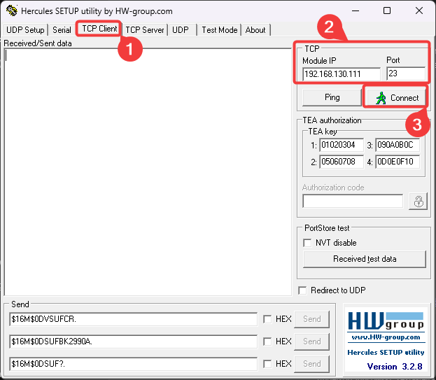
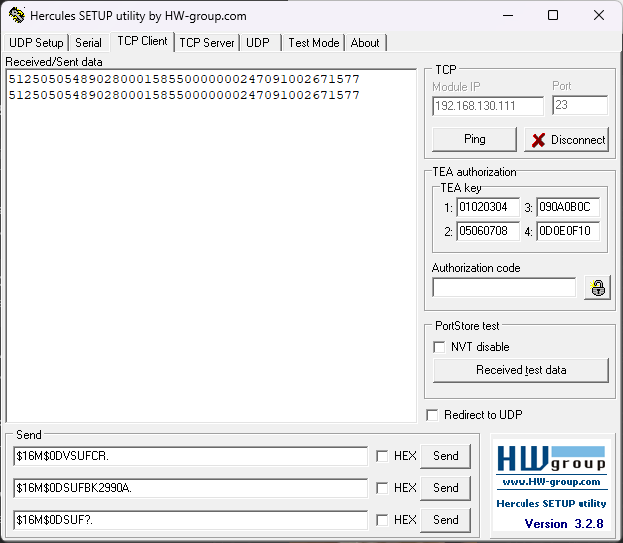

# 🛠 Manual de Configuração QR Code - LTR00026

> Versão 1.0 | Atualizado em: 13/05/2025

---

## 📑 Sumário

- [Termos de Uso](#tdu)
- [Introdução](#int)
- [1. Configuração Inicial](#cap1)
- [2. Configurando Sufixo](#cap2)

## Introdução {#int}

Este documento tem como finalidade instruir e guiar o usuário na configuração do leitor de QR Code LTR00026.

---

## ⚖️ Termos de Uso {#tdu}

Este documento, ou parte dele, não pode ser reproduzido, copiado, modificado e/ou distribuído sem expressa autorização da Saturno Smart. A Saturno Smart reserva-se o direito de revisar e aprimorar seus produtos conforme considerar conveniente. Esta publicação descreve o estado deste produto no momento de sua publicação e pode não refletir o produto em todas as ocasiões no futuro.

---

## 1. Configuração Inicial {#cap1}

A configuração do leitor QR Code LTR00026 é realizada através da leitura de códigos de barras. Imprima esta folha e dobre ela nas linhas tracejadas. Ligue o leitor. Passe cada código de barras em sequência e atentando para o beep que sinaliza a leitura.

## 2. Configurando Sufixo {#cap2}
Para utilizar o LTR00026 com o software Ponto de Controle para leitura de Nota Fiscal, é necessário configurar uma quebra de linha após a leitura da NF. Para isso:
Abra o Hércules Utility e se conecte ao leitor através da aba “TCP Cient” inserindo o IP e porta do equipamento

Se conectado corretamente, exibirá uma mensagem indicando a conexão

Após conectar, envie os seguintes comandos em sequência:

- Para ativar o sufixo: `$16M$0DVSUFCR.`
- Altera sufixo para quebra de linha: `$16M$0DSUFBK2990A.`
- Consulta o sufixo atual: `$16M$0DSUF?.`

Após enviar os comandos, leia algum código de barras duas vezes. Se for exibido o código em duas linhas diferentes, significa que foi configurado corretamente.

