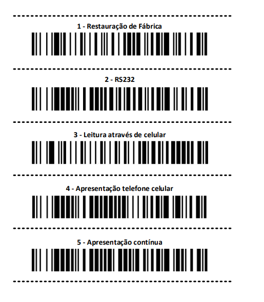

# 🛠 Manual de Configuração QR Code - LTR00026

> Versão 1.0 | Atualizado em: 13/05/2025

---

## 📌1. Configuração Inicial {#cap1}

A configuração do leitor QR Code LTR00026 é realizada através da leitura de códigos de barras. Imprima esta folha e dobre ela nas linhas tracejadas. Ligue o leitor. Passe cada código de barras em sequência e atentando para o beep que sinaliza a leitura.

## 📌 2. Configurando Sufixo {#cap2}

Para utilizar o LTR00026 com o software Ponto de Controle para leitura de Nota Fiscal, é necessário configurar uma quebra de linha após a leitura da NF. Para isso:
Abra o Hércules Utility e se conecte ao leitor através da aba “TCP Cient” inserindo o IP e porta do equipamento

Se conectado corretamente, exibirá uma mensagem indicando a conexão

Após conectar, envie os seguintes comandos em sequência:

- Para ativar o sufixo: `$16M$0DVSUFCR.`
- Altera sufixo para quebra de linha: `$16M$0DSUFBK2990A.`
- Consulta o sufixo atual: `$16M$0DSUF?.`

Após enviar os comandos, leia algum código de barras duas vezes. Se for exibido o código em duas linhas diferentes, significa que foi configurado corretamente.

---
